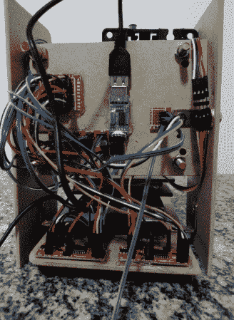

# 光驱数控机床抢了马特·格罗宁的饭碗，哈哈

> 原文：<https://hackaday.com/2014/07/09/cd-drive-cnc-machine-steals-matt-groenings-job-says-ha-ha/>

DIY 数控机床制造起来很有趣。互联网上有很多不同的设计。有些大，有些小。有些是由新材料制成的，有些是由回收零件制成的。[莱昂纳多]最新的[项目](https://github.com/themrleon/OpenCdNC)是在小和回收光谱的绝对远端。他的数控机器是由光盘驱动器制成的，可以画出一个卑鄙的纳尔逊。

首先，拆卸了 CD 驱动器，以便接近托架。这些然后被安装到一个快速和肮脏的木制框架。请注意，Y 轴托架是用螺栓和螺母安装的，可以让床保持水平，这是个不错的主意。安装在 Z 轴托架上的 Bic 笔负责绘图任务。

[莱昂纳多]做了一些不同的事情来生成他的 g 代码。首先，他用 MS Paint 将位图图像转换成单色。然后，使用修改后的 *import_bmp.ulp* 脚本将图像导入 Cadsoft Eagle。位图被转换为 Eagle 认为的焊线轨迹，然后输出为每条焊线的 x 和 y 坐标，并带有一个提升和降低笔的命令。

PC 通过 USB 发送移动命令，通过 pl 2303 hx USB-串行 TTL 转换器发送到 PIC16F628A，pic 16 f 628 a 依次向三个 Easy Driver 步进电机驱动器发送步进和方向信号。步进电机驱动器直接连接到原来的 CD 驱动电机。

休息之后看看视频…

[https://www.youtube.com/embed/3wD8tHKAZS0?version=3&rel=1&showsearch=0&showinfo=1&iv_load_policy=1&fs=1&hl=en-US&autohide=2&wmode=transparent](https://www.youtube.com/embed/3wD8tHKAZS0?version=3&rel=1&showsearch=0&showinfo=1&iv_load_policy=1&fs=1&hl=en-US&autohide=2&wmode=transparent)