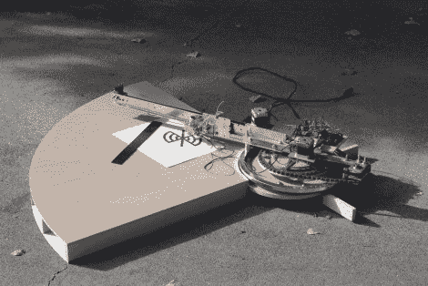

# 中心枢轴笔式绘图仪

> 原文：<https://hackaday.com/2012/09/18/center-pivot-pen-plotter/>

这个[中心枢轴笔式绘图仪](http://dbynoe.blogspot.ca/2012/09/drawing-machine.html)是一个有趣的想法，与龙门式相比，它在某种程度上简化了制造。

通常我们会看到一个在两条轨道上运行的门架，一个打印头沿着它的长度移动。此处，门架仅固定在一侧，通过链条驱动系统使其沿绘图表面旋转。打印头使用细尖毡尖记号笔。如你所料，它仍然沿着手臂移动，并且可以倾斜离开纸张进行重新定位。

硬件上变得简单的东西最终增加了软件的复杂性。传统系统的好处是它使用 X 和 Y 坐标来绘制设计。该机构的枢轴意味着随着打印头远离机器的中心，每个像素之间的距离被放大。但是休息之后的片段证明这个问题已经解决了。

[https://www.youtube.com/embed/lmmpIrCoHY4?version=3&rel=1&showsearch=0&showinfo=1&iv_load_policy=1&fs=1&hl=en-US&autohide=2&wmode=transparent](https://www.youtube.com/embed/lmmpIrCoHY4?version=3&rel=1&showsearch=0&showinfo=1&iv_load_policy=1&fs=1&hl=en-US&autohide=2&wmode=transparent)