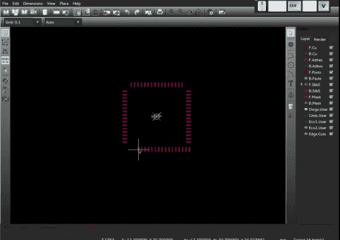

# CERN 展示新的 KiCad 模块编辑器

> 原文：<https://hackaday.com/2014/07/14/cern-shows-off-new-kicad-module-editor/>

欧洲粒子物理研究所，运行一个相当大的粒子对撞机的人，刚刚宣布了他们对 KiCad 项目的最新贡献。这项工作的重点是向模块编辑器添加新的特性，模块编辑器用于为零件创建封装外形。

更新包括对 DXF 文件的支持，这将使导入零件图纸或使用外部工具进行更复杂的设计变得容易。新的分布工具使得均匀地间隔衬垫变得容易。复制和粘贴功能现在允许您设置一个参考点，使其易于对齐块。最后，pad 枚举工具允许您快速设置端号。

CERN 已经为 KiCad 实现了一个新的图形引擎，并展示了一个新的推推路由工具。欧洲核子研究中心 KiCad 贡献的[工作计划](http://www.ohwr.org/projects/cern-kicad/wiki/WorkPackages)显示了他们的长期目标。如果你对 CERN 正在用 KiCad 做什么感兴趣，你可以在 Launchpad 上查看 [CERN KiCad 开发者团队](https://code.launchpad.net/~cern-kicad/)。

休息之后，请快速浏览一下新功能。

[https://player.vimeo.com/video/99235812](https://player.vimeo.com/video/99235812)

【感谢 dkozel 的提示！]