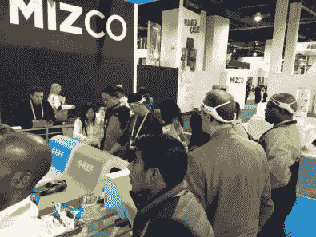
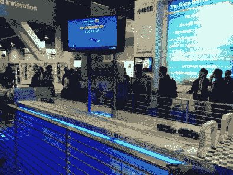
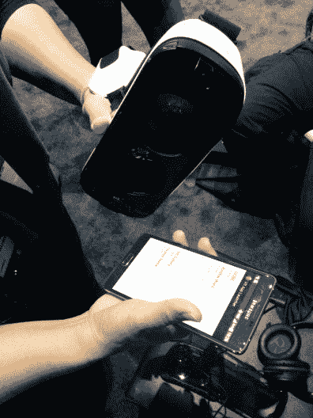
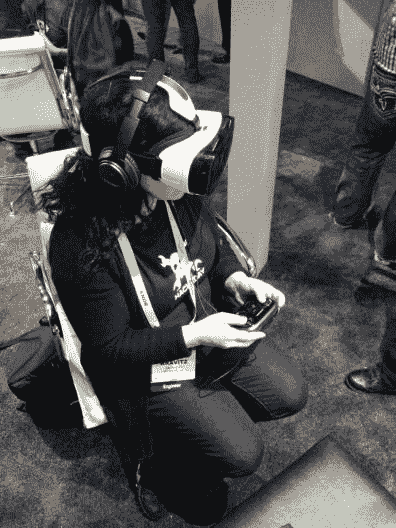
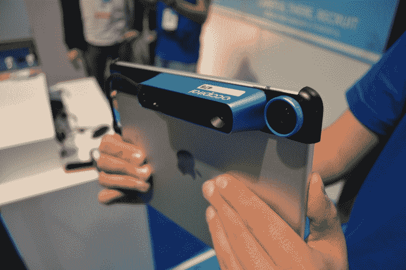

# CES:搭建展台，模拟现实

> 原文：<https://hackaday.com/2015/01/07/ces-building-booths-and-simulating-reality/>

我在 CES 上的第一天开始于在麦卡伦国际机场的出租车站的一次有点有趣的等待。事实上，我有点言过其实了……这要从机场行李认领处的一个效率惊人的取卡亭说起。排队等待大约三分钟，向他们展示在线注册时通过电子邮件发送给你的二维码，你就可以准备好进入 1/4 英里长、六个弯曲的深层出租车线路了。是的，有很多人来参加这个会议。

这东西之大令人震惊。这条街上的每家酒店都挤满了佩戴胸卡的 CES 与会者。许多酒店的会议厅里都摆满了展位，这意味着这些东西分布在一个巨大的地理区域内。我们买了三天的单轨车票，前往会议中心开始。

## 搭建展台

  Emotive Insights headsets  Slot-car “brain racing” with scoreboard

[索菲]知道[本·昂斯沃思]是谁在今年的 IEEE 展位上倾注了全部心血。他的公司 Globacore 为会议搭建展台，这个听起来非常有趣。他是一个小型团队的一部分，该团队基于直接从第一个工厂生产运行中发货的 [Emotive Insight 脑波测量硬件](https://www.kickstarter.com/projects/tanttle/emotiv-insight-optimize-your-brain-fitness-and-per)构建了一个思维控制的阻力带。这与赛道上方的显示屏结合在一起，形成一个引导板。本周我们将密切关注黑客，但建造这些摊位背后的故事可能是找到的最好的黑客。

## 眼睛

  Oculus Gear VX uses a Galaxy Note 4 as the display  Sophi Kravitz trying out Oculus Gear VR

[Ben]直接告诉我们要看的是名为 [Crescent Bay](https://www.oculus.com/blog/oculus-connect-2014/) 的新 Oculus 硬件。他着重提到了*全息甲板*，这是一个我们不能轻易拿来比较的东西。似乎很多人都有这种感觉，因为尝试它的队伍太长了。我们下载了他们的应用程序，允许您安排演示，但所有的预约都已被占用。希望[我们的推特](https://twitter.com/hackaday/status/552856336283607041)请求能被他们的船员看到。

与此同时，我们试用了 Oculus Gear VR。它使用 Galaxy Note 4 作为屏幕，还有镜头和各种运动跟踪和用户控制。演示是一个类似塞尔达的游戏，你可以从头顶上观看场景。它使用手持控制器来命令游戏中的角色，通过耳机的运动跟踪来观察游戏区域。这是一个整洁的演示，我不太喜欢长时间的硬件游戏，但也许我需要先习惯完全沉浸式游戏。

## 另一个维度的窗口

中途在六点钟关闭，我们去了[枕部](https://occipital.com/)展位，正好是他们结束的时候。我以前做过几次 3D 扫描，但那些系统使用转盘和机动轨道上的深度相机来完成工作。这使用了 iPad 的深度相机附件，他们称之为[结构传感器](https://www.kickstarter.com/projects/occipital/structure-sensor-capture-the-world-in-3d)。

该设备捕捉模型的速度惊人。这种高速性能被用于其他用途，比如在 iPad 内部创建一个虚拟世界，用户通过使用屏幕进行导航，就好像它是进入另一个维度的魔法窗口。他们的演示是沿着游戏*门户*的路线进行的，让我们认为 Wii U 控制器对娱乐有正确的想法，但它需要 Occipital 提供的性能。比起 Oculus 演示，我更喜欢这种体验，因为当你在虚拟世界中前进时，你不会与现实世界隔绝。

我们拍摄了一些硬件的视频，并计划在我们有时间编辑镜头时发布更多关于它的信息。

## 找到我们或跟随我们

我们穿着休闲衫，这阻止了(乔希)的脚步。他在这里和他的公司 Evermind 做生意，但是像任何优秀的黑客一样，他在口袋里带着一个他热爱的项目。他展示的是他正在制作的 CANbus 嗅探器和接口设备的几个原型。

我们整个星期都会在 CES 上。你可以通过以下推特账号关注我们的进展: [@Hackaday](https://twitter.com/hackaday) 、 [@HackadayPrize](https://twitter.com/hackadayprize) 、 [@Szczys](https://twitter.com/szczys) 和 [@SophiKravitz](https://twitter.com/sophikravitz) 。如果你亲自来这里，你可以发微博告诉我们我们在哪里。我们还计划周四上午 9 点在蒙特卡洛[的 SambaLatte 举行早餐会。我们希望你能过来打个招呼。别忘了自带硬件！](http://sambalatte.com/locations/monte-carlo/)