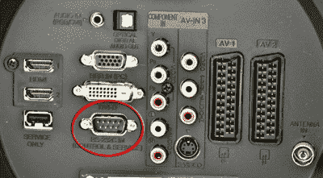

# 通过 IP 更改电视频道

> 原文：<https://hackaday.com/2013/08/16/change-the-tv-channel-over-ip/>

[穆斯塔法·杜尔]写信告诉我们他用智能手机控制电视的黑客行为。现在,“T2 一个人遥控统治他们”( T3)黑客最近越来越受欢迎，所以我们认为他就是这样做的。我们错了。他正在用他的卫星接收器提供互联网连接。它向他的 LG 47LH50 电视推送命令，该电视有一个 RS-232 端口。

上图是另一台 LG 电视的背面(它来自[一个关于用 PC 控制电视的论坛帖子](http://www.edaboard.com/thread234610.html))。[Mustafa]使用的是 Dreambox DM800 卫星接收器，它也有一个串行端口，他可以远程登录。他在互联网上搜索，发现应该可以用一根零调制解调器电缆连接两者。他最初的测试没有任何反应，但对盒子的 com 端口设置的调整让他第一次得到了关闭电视的命令。经过一点调整，他能够锁定可靠的通信，并通过编写自己的启动脚本来保持这种通信。从那以后，他开始开发 Python 脚本，作为基于网络的控制界面的后端。

如果你想知道这种串行连接[还能做些什么，请阅读这篇文章](http://hackaday.com/2011/07/21/lg-tv-hacking-via-serial-connection-or-ir-codes/)，它使用一个脚本来尝试每一种可能的命令组合。