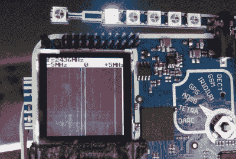
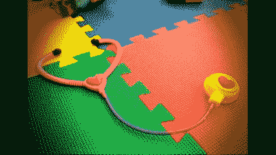
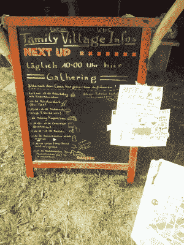

# 混沌交流营 2015:徽章、演讲和文化

> 原文：<https://hackaday.com/2015/08/16/chaos-communication-camp-2015-dispatch-from-the-middle/>

### Rad1o 徽章

rad1o 徽章是这个伟大的独立 HackRF 克隆，也是伟大的硬件黑客平台。在第二天和第三天的大部分时间里，人们基本上分成了两个阵营:那些只是对 [GNURadio](http://gnuradio.org/) 和软件定义无线电(SDR)方面的事情感兴趣的人，以及那些修改和添加 Radio 固件以启动和运行各种外围设备或只是制作甜美动画的人。

第三天晚上，一切都变了。[iggy]设法将[HackRF porta pack](http://hackaday.com/2014/08/17/defcon-22-the-hackrf-portapack/)库[移植到 rad1o 徽章](https://github.com/rad1o/f1rmware/tree/porta)上。我们对这个代码感到兴奋，因为它让徽章的无线电和微控制器侧协同工作，这意味着像独立的 SDR 无线电嗅探器和瀑布图(图中拾取 WiFi 和蓝牙信号)这样的东西是可行的。将徽章用作独立的发射和接收平台已经不远了。rad1o 的事情开始变得很酷，还有两天的营地时间。

与此同时，在特别提款权方面，昨晚 GNURadio 研讨会上座无虚席，由于它非常受欢迎，周日将再次举行。慕尼黑 CCC 目前正在进行一场伟大的 SDR 寻宝活动，来自慕尼黑的[Sec]和[Schneider]在结束时发表了关于窃听铱星寻呼系统的演讲:在帐篷内解码寻呼机信标信号的现场演示，在定制软件和 rad1o 徽章上运行。

### 会谈

我们参加了[互联网档案馆的](https://archive.org/)关于[的讲座](https://media.ccc.de/browse/conferences/camp2015/camp2015-6939-towards_universal_access_to_all_knowledge_internet_archive.html)。如果你不知道 IA，他们运行着 Wayback 机器，保存了一堆老派的视频游戏，目前正在运行一个大规模的图书扫描项目。谈话的重点包括他们对入侵的国家安全信件进行合法自卫的故事，以及他们的变通办法的背景，即使书籍仍受版权保护，他们也可以借出书籍。

与此同时，[威尔·斯科特]在 open proxy 上做了一个[的演讲。多亏了保存下来的对话，我们都看了。市面上的许多计算机(意外地或以其他方式)允许人们代理他们的数据](https://media.ccc.de/browse/conferences/camp2015/camp2015-6765-understanding_open_proxies.html)

[Lieven Standaert]关于原型制作的[演讲](https://media.ccc.de/browse/conferences/camp2015/camp2015-6688-a_practical_prototyping_primer.html)很好地总结了他通过指导学生完成一些雄心勃勃的设计项目而学到的一系列技巧和诀窍。他有一个完整的实验室，配有数控铣床、激光切割机和 3D 打印机，演讲的重点是如何最有效地使用这些不同的工具，发挥它们各自的优势。

【Tarek Lou Bani】发表励志演讲“ [3D 打印高质量低成本免费医疗硬件](https://media.ccc.de/browse/conferences/camp2015/camp2015-6703-3d_printing_high-quality_low-cost_free_medical_hardware.html)”。基本上，他研究了听诊器的设计，并重新设计了一个 3D 打印版本。听诊器的所有技术都在外壳设计和形状上，它们相对昂贵，所以这是一个非常容易实现的目标。如果你想用你的 3D 打印机做点好事，看看这个演讲吧。(并不是说印出带礼帽的猫头鹰对世界不重要……)

如果你想提升自己的 DIY 电子产品制造能力，【hunz】关于[“挑战 DIY 电子产品的极限”](https://media.ccc.de/browse/conferences/camp2015/camp2015-6634-pushing_the_limits_of_diy_electronics.html)的演讲值得一看。随着酷部件变得越来越小，DIYer 面临着许多新的挑战，从薄走线到 BGA 部件的回流焊接。一个很好的提示:一些电路板公司提供免费的 SMD 焊接模板，从他们那里订购一个单面 PCB 板是很值得的。他还参与了 DIY 制造的设计，包括对传输线的讨论，我们发现这很有帮助。

这里还有两个演讲，我们可能不需要告诉你很酷:[太空黑客](https://media.ccc.de/browse/conferences/camp2015/camp2015-6679-how_to_become_a_space_hacker.html)和[战斗机器人](https://media.ccc.de/browse/conferences/camp2015/camp2015-6823-building_your_first_combat_robot.html)。我们还需要多说吗？这两个讲座都是介绍性的和一般性的，如果你需要一点鼓励来参与，你会在这里找到它。

### 营地生活:孩子和湖

好吧，我们不打算撒谎:过去两天天气变热了。非常热。那么，营地生活最美好的特征之一就是湖(或者说是湖泊，因为在营地外面还有一个湖更大，但不太受欢迎)。如果你已经睡了一觉，并且你的黑客项目进展顺利，或者天气太热而无法工作，没有什么比泡在凉水里更好的了。见鬼，即使你有黑客要做，游泳休息一个小时。毕竟，这就是夏令营的特别之处。

 最后，我们惊讶于这一次儿童友好营变成了什么样。对于还太年轻的黑客来说，这里的住宿条件相当不错。从一个宠物动物园到一个巨大的装满乐高积木的帐篷，再到几乎排满的手指画和儿童艺术工艺品，如果你是五岁，你在营地可以做的事情几乎和你 25 岁时一样多。时间流逝，即使是黑客也不会永远年轻，看到社区照顾下一代真是太棒了。另外，孩子们似乎很喜欢。

### 发生

再说一次，营地里发生了这么多事情，很难跟上每件事。浏览存档的谈话，看看有什么让你感兴趣的。如果你找到了你喜欢的东西，请在评论中发表。