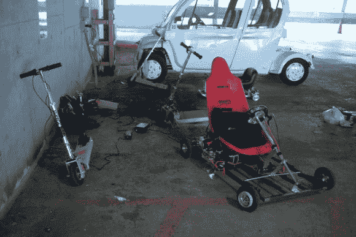

# [查尔斯]史诗般的“全面回顾”卡丁车帖子

> 原文：<https://hackaday.com/2013/10/27/charless-epic-total-recap-gokart-post/>

如果你在过去几年制造了一辆电动汽车，你可能会欠(查尔斯)几杯啤酒。现在，当你读了他的 17500 字、10 部分的帖子，涵盖了你需要知道的关于电动卡丁车设计的一切，你会对他更加感激。你会想吃个三明治陪陪你。

你可能还记得今年夏天早些时候[帖子里的 Chibikart】，这是【查尔斯】袖子里无数电动汽车项目中的一个。他一直在教麻省理工学院的学生如何建造电动卡丁车，这部“2.00gokart”小说是[查尔斯]分享财富的方式。然而，这不仅仅是一个简单的操作指南。相反，它读起来像是教师版的*卡丁车 101* ，有一些简短而重要的历史，对该类如何发展的演练，供应商的详尽链接，图表，视频，以及大量的参考资料和文档。](http://hackaday.com/2012/06/05/chibikart-step-by-step-lets-you-build-your-own-tiny-wheel-racer/)

如果你对电动汽车有一丁点兴趣，那就帮自己一个忙，浏览一下吧。休息之后有几个视频，如果你需要更多的动力，可以看看使用很多相同部件的 [EV 滑板](http://hackaday.com/2013/08/10/diy-23mph-electric-skateboard/ "DIY 23mph+ electric skateboard")。

[https://www.youtube.com/embed/jMQTf5y0jvQ?version=3&rel=1&showsearch=0&showinfo=1&iv_load_policy=1&fs=1&hl=en-US&autohide=2&wmode=transparent](https://www.youtube.com/embed/jMQTf5y0jvQ?version=3&rel=1&showsearch=0&showinfo=1&iv_load_policy=1&fs=1&hl=en-US&autohide=2&wmode=transparent)

[https://www.youtube.com/embed/S17tWqCAWzQ?version=3&rel=1&showsearch=0&showinfo=1&iv_load_policy=1&fs=1&hl=en-US&autohide=2&wmode=transparent](https://www.youtube.com/embed/S17tWqCAWzQ?version=3&rel=1&showsearch=0&showinfo=1&iv_load_policy=1&fs=1&hl=en-US&autohide=2&wmode=transparent)

[https://www.youtube.com/embed/VMMKgGTeb-I?version=3&rel=1&showsearch=0&showinfo=1&iv_load_policy=1&fs=1&hl=en-US&autohide=2&wmode=transparent](https://www.youtube.com/embed/VMMKgGTeb-I?version=3&rel=1&showsearch=0&showinfo=1&iv_load_policy=1&fs=1&hl=en-US&autohide=2&wmode=transparent)

谢谢[查尔斯]