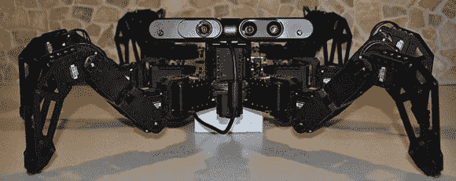

# 夏洛特，拥有 3D 视觉的六足动物

> 原文：<https://hackaday.com/2013/05/29/charlotte-the-hexapod-with-3d-vision/>

夏洛特的底盘来自[作为一个套件](http://www.trossenrobotics.com/phantomx-ax-hexapod.aspx)，但股票电子产品是基于 Arduino 的——不是为需要运行计算机视觉应用程序的机器人准备的。[Kevin]最后用 Raspi 做控制器，用华硕 XTION 给夏洛特做眼睛。编辑:或者[一个 PrimeSense 传感器](http://www.primesense.com/developers/get-your-sensor/)这些传感器是结构光深度相机，就像 kinect 一样，只是更小，更轻，并且有更好的颜色输出。

硬件只是等式的一半，所以[Kevin]扔掉了基于 Arduino 的普通电子设备，用树莓 Pi 取而代之。这使他能够磨练自己的 C++技能，并添加一个非常酷的外设——XTION 深度相机。

令许多人惊讶的是，我们确信，[凯文]正在他的树莓 Pi 上运行 [OpenNI](http://www.openni.org/) ，允许夏洛特从她的深度相机中读取数据，并避免撞到任何物体。当然，Raspberry Pi 是超频的，CPU 使用率徘徊在 90%左右，但如果你正在寻找一个使用深度传感器和 Pi 的项目，这就是你要去的地方。

[https://www.youtube.com/embed/9iE3Yv2s6n4?version=3&rel=1&showsearch=0&showinfo=1&iv_load_policy=1&fs=1&hl=en-US&autohide=2&wmode=transparent](https://www.youtube.com/embed/9iE3Yv2s6n4?version=3&rel=1&showsearch=0&showinfo=1&iv_load_policy=1&fs=1&hl=en-US&autohide=2&wmode=transparent)