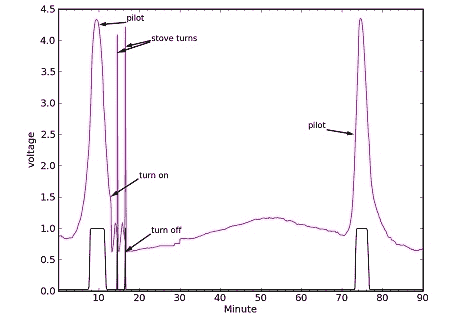

# 绘制沸水效率的图表

> 原文：<https://hackaday.com/2012/06/02/charting-the-efficiencies-of-boiling-water/>

水需要很多能量来加热。如果你想要这方面的证据，只需在阵亡将士纪念日跳进华氏 50 度的游泳池。尽管烧水很困难，但这个简单的动作却占据了很多工业流程。从烹饪牛排到运行核反应堆，没有什么不涉及加热水的。

加州大学圣迭戈分校的物理学教授汤姆·墨菲决定测试他烧水的效率到底有多高。他配备了煤气炉、电水壶、微波炉，并在煤气表上安装了一个简洁的激光笔/光电二极管来测量消耗量，他精确地计算了自己泡茶所用的能量。

[汤姆]实验的最终数据显示，煤气炉——在大小燃烧器上使用带盖和不带盖的锅——效率约为 20%。燃气热水器的效率要高得多，为 55%，但微波炉和电水壶的效率很低，分别为 15%和 25%。用电来加热水的低效率是有原因的；如果只考虑来自墙壁的电力，电水壶将消耗的 80%的能量直接放入水中。因为电力必须来自某处的*，*通常是以 30%左右的效率运行的化石燃料发电厂，将恐龙变成热水的电热水壶方法只有大约 25%的效率。

由此得出的结论是，每次你洗澡、煮咖啡或洗碗时，都会浪费大量的电能。通过减少我们使用的能源，我们都可以做得更好，就像[汤姆]比他的邻居节省五分之一的能源。干得好，[汤姆]。