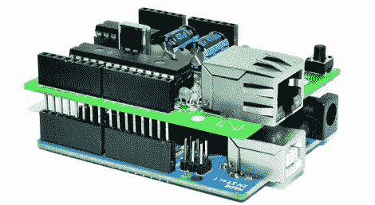

# 像芯片一样便宜的 Arduino 以太网屏蔽

> 原文：<https://hackaday.com/2012/07/10/cheap-as-chips-arduino-ethernet-shield/>

众所周知，Arduino 的以太网屏蔽有点贵。由于官方的以太网屏蔽售价约为 50 美元，而其他选项并不便宜，Arduinofied 以太网还有很大的改进空间。开放电子公司的鲍里斯有一个解决这个问题的办法:他的以太卡由一个 3 美元的以太网控制器供电。

以太卡使用[微芯片 ENC28J60](http://www.microchip.com/wwwproducts/Devices.aspx?dDocName=en022889) ，一个通孔以太网控制器。除了一个 RJ45 插孔、电容、电阻和一个廉价的缓冲芯片，板上没有太多其他东西。这块板被设计成易于生产，我们认为在家里蚀刻这块板是可能的。

这种 ENC28J60 以太网屏蔽有一些缺点——官方的 Arduino 以太网屏蔽具有 10/100 Mbps 的连接，而微芯片供电的屏蔽被限制在 10 Mbps。考虑到降低的成本、组装的简易性，以及用 Arduino 来饱和 100Mbps 的连接相当困难的事实，这个缺陷很容易被忽略。

非常漂亮，尤其是考虑到你可以在 Arduino 上用以太网连接做多少事情。git 中可用的文件和代码[。](https://github.com/jcw/ethercard)