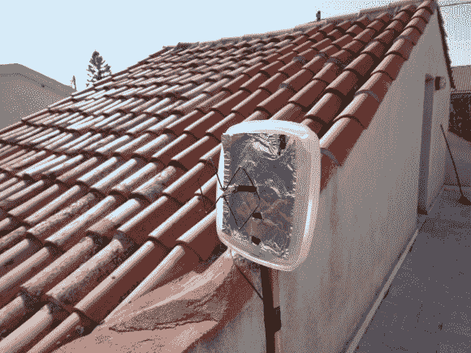

# 廉价的双二阶天线扩展公寓之间的局域网

> 原文：<https://hackaday.com/2012/11/27/cheap-biquad-antenna-extends-lan-between-apartments/>

[Danilo Larizza]正在几个公寓间共享网络连接。它们相距不远，但也不相邻，因此需要一组外部天线。他在廉价的 ( [翻译](http://translate.google.com/translate?sl=auto&tl=en&js=n&prev=_t&hl=en&ie=UTF-8&layout=2&eotf=1&u=http%3A%2F%2Fwww.danilolarizza.com%2F%3Fp%3D77))上建造了这个 2.4 GHz 的双二阶天线，只是为了在他试图购买一个合适的天线之前测试它是否能改善信号。事实证明，这是他所需要的一切。

天线本身是大约一米厚的电线，弯曲成两边各 31 毫米的正方形。通向路由器的同轴电缆连接到该天线的中心部分。为了更好地定向接收，他加了一些锡箔作为反射器。由于这是在户外，他使用了一个食物储存容器进行保护(天线安装在盖子上，在这张照片中，机身已被移除)。整个东西是栖息在一个花盆的木桩上，与其他天线有适当的视线。

我们已经看到[一个非常相似的设计用于 NRF 24L01+收音机](http://hackaday.com/2012/05/18/adding-kilometers-to-a-radio-meant-only-for-meters/)。如果你需要更多的细节，这将是一个很好的研究项目。