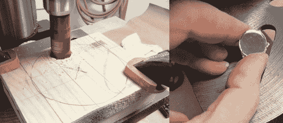

# 便宜(免费？)为您的 CO2 激光器更换镜子

> 原文：<https://hackaday.com/2014/01/16/cheap-free-mirror-replacement-for-your-co2-laser/>

你知道什么最贵吗？激光切割机中使用的那些小镜子——它们也不会永远存在！如果我们告诉你，使用一个损坏的硬盘可以免费制作你自己的硬盘，会怎么样？

[Tim Wehr]了解到在 BuildLog.net 上使用[硬盘作为镜像，并决定亲自尝试一下，看看它们的效果如何。他很快抢救出一个旧硬盘，并删除了以往任何时候都如此闪亮的盘片。他用几块木头夹住盘子，然后用金属孔锯在盘子上切割出圆形——边缘有点粗糙，所以如果你打算尝试这个，我们建议你买一把钻石孔锯。](http://www.buildlog.net/forum/viewtopic.php?f=32&t=1000)

后来用工业酒精抛光，边缘用锉刀锉了一下，他换了一面镜子。然后，他在他的 CO2 激光器上使用原件和 HDD 镜像进行了两次测试。几乎相同的切割力。事实上，[Tim]认为硬盘镜像看起来甚至切割得更好！还不错！

[谢谢丽娃！]