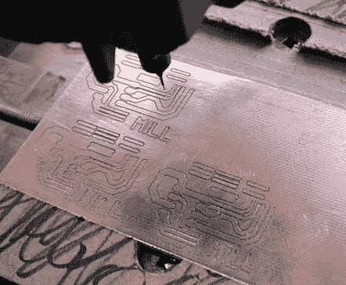

# 便宜，足智多谋的 DIY 迷你数控路由器/轧机装置

> 原文：<https://hackaday.com/2014/02/12/cheap-resourceful-diy-mini-cnc-routermill-contraption/>

很少有普通读者会不同意这句经典的话:需要是发明之母。说到这台[迷你三轴数控机床](http://cq.cx/pcb-router.pl)，这种说法一点也不夸张。建筑商[Jonathan]需要一种方法来制作他设计的电路板原型。虽然他不可否认地没有像他计划的那样经常使用它，但这个旅程是一个发明和解决问题的旅程。

[乔纳森]从他自己的设计开始。他的第一台机器是移动龙门式的(工件不移动)，最终没有达到他的预期。主要问题是轴轨的对齐。没有气馁，[Jonathan]从版本 2 开始。这一次，工件将像传统的立式铣床一样沿 X 和 Y 方向移动。Porter-Cable 层压板微调器将沿 Z 轴上下移动。很明显，这个框架是专门为这个项目建造的。虽然不是最漂亮的，但这个框架功能齐全，硬度也令人满意。

每个轴由一个多余的步进电机驱动，并通过 1/4-20 螺纹杆丝杠传递动力。安装在聚丙烯轴承座中的轴承用于轴向定位丝杠。这一点很重要，因为步进电机轴承不是为承受轴向载荷而设计的。由塑料空气软管制成的挠性联轴器可补偿电机轴和丝杠之间的任何错位。

机器运行一段时间后，遇到了一个有趣的问题(对我们读者来说)。木头和 PCB 灰尘与用于润滑轴轨的油脂混合。这种材料的组合变成了一种胶状物质，使轴难以移动。需要进行彻底的拆卸来清除粘性物质。干膜润滑剂被证明是这种应用的更好选择。

[Jonathan]遇到了大多数数控机床制造商面临的常见问题。他的解决方案简单而有效，这就是为什么这个建筑如此伟大。