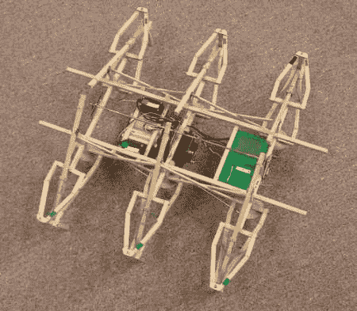

# 廉价的木制六足框架大大降低了成本

> 原文：<https://hackaday.com/2012/05/17/cheap-wooden-hexapod-frame-greatly-reduces-cost/>

[Balline]真的很想玩六足动物，但发现成本太高。作为一名机械工程师，他能够相当快地设计出一个稳定的伺服系统，让他能够在这个平台上进行实验。他选择使用木材作为建筑材料，以进一步降低成本。正如你在休息后的视频中看到的，他的设计传播得相当好。他整个东西的成本，包括 3 个伺服系统，基本邮票爱好板，回收电池和框架，不到 100 美元。

这是一个很好的系统，尽管他不公平地将成本与他过去见过的跳舞系统进行了比较。来吧，你的机器人不是没有。不过还是很酷。

[https://www.youtube.com/embed/5eQiegKdlzc?version=3&rel=1&showsearch=0&showinfo=1&iv_load_policy=1&fs=1&hl=en-US&autohide=2&wmode=transparent](https://www.youtube.com/embed/5eQiegKdlzc?version=3&rel=1&showsearch=0&showinfo=1&iv_load_policy=1&fs=1&hl=en-US&autohide=2&wmode=transparent)