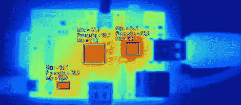

# 查看覆盆子馅饼的温度

> 原文：<https://hackaday.com/2012/06/23/checking-out-the-temperature-of-a-raspberry-pi/>

[雷米]有一个非常好的福禄克热感相机，所以当他的树莓皮进来时，他[将热感相机对准 Raspi](http://www.geektopia.es/es/technology/2012/06/22/articulos/se-calienta-el-ordenador-raspberry-pi-estudio-de-sus-temperaturas-en-funcionamiento.html) (西班牙语，[谷歌翻译](http://translate.google.com/translate?sl=es&tl=en&js=n&prev=_t&hl=en&ie=UTF-8&layout=2&eotf=1&u=http%3A%2F%2Fwww.geektopia.es%2Fes%2Ftechnology%2F2012%2F06%2F22%2Farticulos%2Fse-calienta-el-ordenador-raspberry-pi-estudio-de-sus-temperaturas-en-funcionamiento.html&act=url))，看看这台整洁的计算机在过热之前能被推多远。

树莓 Pi 上有三个主要的热源:稳压器、[USB/以太网控制器](http://www.smsc.com/media/Downloads_Public/Data_Briefs/9512db.pdf)和[博通 SoC](http://www.raspberrypi.org/wp-content/uploads/2012/02/BCM2835-ARM-Peripherals.pdf) 。空闲时，这些器件的读数分别为 49.9°C、48.7°C 和 53°C；触摸起来有点热，但仍在这些器件数据手册给出的温度范围内。

真正的测试是通过压力测试进行的，测试中 ARM CPU 的利用率为 100%。Broadcom SoC 几乎达到了 65°C，而以太网控制器和调节器设法达到了 50s 左右。请记住，该测试是在室温下进行的，如果要安装在极端环境中，如温室或用作佛罗里达或德克萨斯的 carputer，我们可能会在 Raspberry Pi 上安装散热器。

感谢[Alberto]发送此邮件。