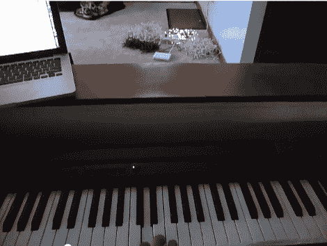

# 圣诞准备提前开始:MIDI 控制灯串

> 原文：<https://hackaday.com/2012/07/03/christmas-prep-starts-early-midi-control-for-strings-of-lights/>

如果你计划用今年的圣诞装饰超越自己，现在是开始计划的时候了。毕竟，既然可怕的高温让户外活动变得汗流浃背，你还能做些什么呢？从刚刚为他的圣诞灯串完成原型制作的无线 MIDI 控制器中获得一些灵感。你可以看到远处的四个线轴在他弹钢琴时亮起来。

无线链接由 WiFi 接入点提供，该接入点使用其 USB 端口来控制外部硬件。这是[一个 USB 位重击器板](http://www.sparkfun.com/products/762)，它反过来驱动一个继电器板，该继电器板被设计用来切换电源电压。该装置的高压部分安装在一个塑料食品储存容器中，该容器装有两对插座，总共驱动四个通道。[Tim]对结果很满意，他在休息后的视频中展示了这一结果，并希望为今年的庆祝活动扩展到总共 16 个频道。

[https://www.youtube.com/embed/bRHG5YQo3sk?version=3&rel=1&showsearch=0&showinfo=1&iv_load_policy=1&fs=1&hl=en-US&autohide=2&wmode=transparent](https://www.youtube.com/embed/bRHG5YQo3sk?version=3&rel=1&showsearch=0&showinfo=1&iv_load_policy=1&fs=1&hl=en-US&autohide=2&wmode=transparent)