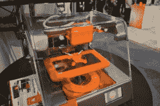
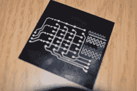
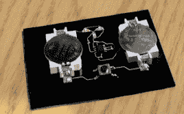

# 电路打印机:Voltera 和 Voxel8

> 原文：<https://hackaday.com/2015/01/09/circuit-printers-voltera-and-voxel8/>

在 2015 年消费电子展上展出的两款打印机引起了我们的兴趣。他们是 Voltera 和 Voxel8。每一个都在接受印刷电路的挑战。他们使用相似的技术，但处理问题的方式却截然不同。

## 体素 8

 [![[Michael Bell] poses with the Voxel8](img/bedcf0a3b8aa6662806fb85e68e6ba79.png "DSC_0405")](https://hackaday.com/2015/01/09/circuit-printers-voltera-and-voxel8/dsc_0405/) [Michael Bell] poses with the Voxel8  Quad on the print bed of the Voxel8  3D printed quadcopter — conductive traces and all

Voxel8 将 3D 打印机的想法与银导电墨水分配器结合在一起。你首先要对你的整个设计建模，包括硬件和电子设备。然后，打印机将开始 3D 打印，必要时会暂停，以便您添加电子和机械设备。在部件及其引脚就位后，它会铺开导电墨水来连接组件，然后继续 3D 打印来完成物体。

## 伏尔泰呢

 [![[Alroy Almeida] poses with the Voltera](img/ac9a8a77121097871319c34923a99c71.png "DSC_0432")](https://hackaday.com/2015/01/09/circuit-printers-voltera-and-voxel8/dsc_0432/) [Alroy Almeida] poses with the Voltera  PCB demo, colored traces are for insulation between layers  PCB with components populated

[Voltera](http://volterainc.com/) 是一款使用银导电墨水的 PCB 打印机。它将油墨印刷到基底上。印刷完成后，由油墨制成的焊盘用于将元件焊接到位。这种设计的诀窍是能够在纸板的同一面打印两层。第二种墨水材料是绝缘体。在印刷第二层导电层之前，将它放在第一层导电层上，允许走线相互交叉。

祝贺 Voltera 团队在 CES 上赢得了 2015 年硬件战场的 50k 美元。

## 我们的想法

我们没有看到足够的东西来动摇我们对银导电墨水在原型板上取代铜的可行性的怀疑。但如果有人要证明这两种产品是可信的，那么这两种产品是可信的。

关于 Voxel8 的一个有趣的事情是能够将点对点布线指定为一个“部分”。如果你这样做，机器会暂停，而你焊接到位的电线，然后封装他们与其余的打印。当然，如果你打算手动操作，用哪台打印机并不重要。

你如何看待用于原型制作的导电墨水的未来？请在评论中告诉我们。