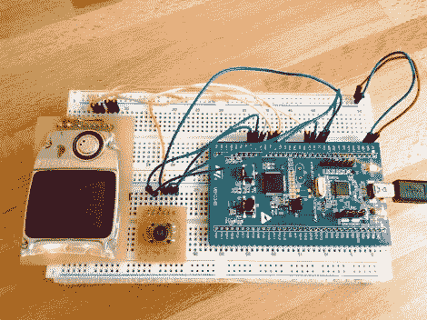

# ARM 控制器上的经典贪吃蛇游戏

> 原文：<https://hackaday.com/2012/09/21/classic-game-of-snake-on-an-arm-controller/>

时不时地，我们会停下来，看看你那些了不起的项目，然后开始自己的工作。我想我应该花一分钟展示一下我的贪吃蛇游戏。这是我记得高中时在图形计算器(TI-83)上玩的经典游戏。我从未编写过自己的版本，因此决定在 ARM 平台上多花些时间。

我使用的开发板是 STM32 F0 发现板。一旦我有了一个在 Linux 机器上编译代码的可用模板，其他的事情就开始变得井井有条了。屏幕是诺基亚 3595 的。几年前，我切断了键盘，为它做了一个分线板。它很暗，但很小，并且使用 SPI，所以它往往是我进行原型制作的首选显示器。但是我确实以大约 16 美元的价格得到了一个 SSD1289 TFT 屏幕(在[写了这个项目](http://hackaday.com/2012/07/05/library-for-driving-ssd1289-lcd-displays-with-small-microcontrollers/)之后),并且我已经取得了一些成功。它使用并行接口，所以不容易连接，我在 24 MHz 下运行时遇到了一些串扰问题。

但是我跑题了。休息之后看看我的简单游戏的演示视频。在上面的链接中有更多关于我的编程选择的细节。你很快会再次看到这个硬件。我正在开发一个片上调试初级程序，这些 ARM 开发板非常适合它！

[https://www.youtube.com/embed/gSOHh0SQNOo?version=3&rel=1&showsearch=0&showinfo=1&iv_load_policy=1&fs=1&hl=en-US&autohide=2&wmode=transparent](https://www.youtube.com/embed/gSOHh0SQNOo?version=3&rel=1&showsearch=0&showinfo=1&iv_load_policy=1&fs=1&hl=en-US&autohide=2&wmode=transparent)