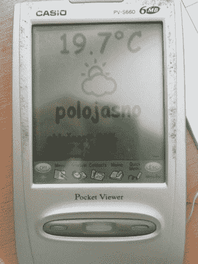

# 经典的 PDA 发现第二次生命作为网络触摸屏显示器

> 原文：<https://hackaday.com/2013/09/19/classic-pda-finds-second-life-as-a-network-touch-screen-display/>

[托马斯·詹科]有一个旧的卡西欧袖珍浏览器 PDA 收集灰尘。他没有扔掉它，而是决定把它重新用作显示时间、天气和车库门当前状态的显示器。

卡西欧口袋浏览器是 Palm Pilot 的竞争对手。这两个系统甚至共享相同的 LCD 分辨率——160×160 单色。[Tomas']具体型号是 S660，配备 6 兆内存和 NEC V30MZ(英特尔 8086 兼容)处理器。与 Palm 类似，卡西欧也免费提供了一个 SDK。

卡西欧的 SDK 仍然可用，[托马斯]也能让它在自己的电脑上运行。然而，发展并非没有陷阱。Pocket Viewer SDK 上次更新是在 2001 年 4 月。软件是用 C 写的，但是不支持当时新的 C99 标准。SDK 确实包括模拟器和调试器，但它也不像今天的系统那样完美——每个模拟器启动都是从设置时钟和校准触摸屏开始的。跳完之后继续阅读，了解他克服的其他障碍。

pocket viewer 与外界的唯一连接是通过 RS-232 链接。[Tomas]能够使用串行链接将 pocket viewer 连接到他运行定制 PHP 代码的服务器上。起初，他试图向 PV 发送全屏数据。这被证明在串行速度下太慢了。事实证明，只更新屏幕上发生变化的部分要快得多。在整个屏幕发生变化的情况下(这种情况不太可能发生)，Tomas 会分块发送屏幕，这样用户仍然可以在显示屏上看到活动。

点睛之笔是电源。这个袖珍观察器是用 AAA 电池设计的。[托马斯]安装了一个 3V 调节器，但即使这样，系统也会随机复位。袖珍观察器的内部直流-DC 转换器产生了他的调节器无法处理的电流尖峰。一个 100uf 的电容最终稳定了电源。

[托马斯]最后一次破解是在他的车库门和路由器之间增加一个接口。路由器更新其服务器上的车库门状态。然后，服务器为 pocket viewer 格式化这些信息，让[托马斯]知道车库是开着还是关着。

我们认为这是重用旧硬件的一个很好的例子。我们当中有多少人身边放着一辆旧 PDA？如果能看到更多的垃圾像这样被利用，而不是被回收或者更糟的是，被送到垃圾填埋场，那就太好了。