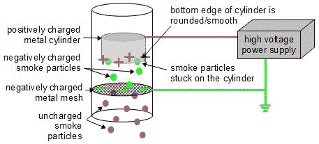

# 用静电除尘器清除烟尘

> 原文：<https://hackaday.com/2014/03/13/cleaning-up-smoke-with-an-electrostatic-precipitator/>

[史蒂夫·杜弗兰的]为我们找到了另一个伟大的项目——一个能有效消除烟雾的装置！

它被称为静电除尘器，其工作原理类似于今天许多汽车使用一种叫做[静电涂层的工艺来喷漆。](http://en.wikipedia.org/wiki/Electrostatic_coating)静电喷涂的工作原理是让油漆颗粒带静电，与车身面板上的电荷相反，这使得两者相互吸引，从而使用大约 95%的喷涂油漆，几乎没有任何过度喷涂，并且与靴子的结合更好！

[史蒂夫的]尝试了这个创造烟尘净化器的实验，最终目标是用它来处理汽车尾气。到目前为止，他已经完成了几个设计，最终有了一个非常好的设计。其实也没那么复杂，看看下图就知道了。

当烟雾进入管子时，它穿过一个细小的金属网，这个金属网由他自制的高压电源带负电。这使得烟雾颗粒带负电荷，当它们继续漂浮时，会被带正电荷的金属管吸引。低头看看——没有烟从这里升起。不相信我们？查看演示:

[https://www.youtube.com/embed/x5YFK8mmeRQ?version=3&rel=1&showsearch=0&showinfo=1&iv_load_policy=1&fs=1&hl=en-US&autohide=2&wmode=transparent](https://www.youtube.com/embed/x5YFK8mmeRQ?version=3&rel=1&showsearch=0&showinfo=1&iv_load_policy=1&fs=1&hl=en-US&autohide=2&wmode=transparent)