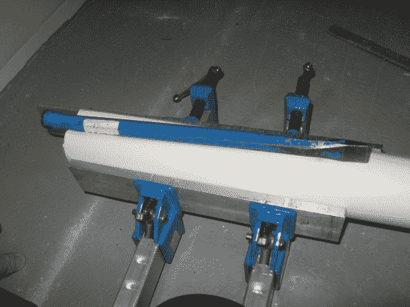

# 巧妙利用聚氯乙烯制作立式办公桌

> 原文：<https://hackaday.com/2014/03/16/clever-use-of-pvc-to-make-a-standing-desk-at-work/>

[丹尼尔]和他的同事[克里斯]对立式办公桌的概念很感兴趣——不幸的是，公司不打算给他们买一张新桌子来测试——所以他们决定自己改造桌子！

他们使用的宜家桌子有三个可调节的桌腿——只是不是那种可调节站立的桌子。面临的挑战是如何修改这些表格，使其可以轻松反转，他们不想让设施部门对他们发火！最初，他们想使用钢腿来保持结构稳定，但发现他们必须用他们没有的工具对钢管进行相当多的修改。所以他们选择了 PVC。

[Chris]记得在这里看到一个关于加热 PVC 管使其具有延展性的黑客——尽管我们可能无法找到他指的是什么，但在 YouTube 上快速搜索会找到很多关于如何做到这一点的教程。

使用热风枪、一些夹子和撬棍，他们能够在管道中添加草皮，以复制原始的宜家支腿。

接下来，他们需要做的就是安装一个螺纹 PVC 管件(桌子的脚踝？)的脚，并把它放在一起。匹配喷漆的颜色，他们就完成了。一个超级简单，实用，可逆的方法让他们一整天都站着！

他们只花了 23.83 美元。