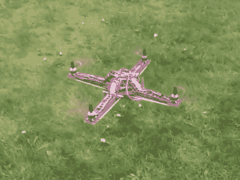

# 攀登四轴飞行器设计的高峰

> 原文：<https://hackaday.com/2012/04/24/climbing-the-mountain-of-quadcopter-design/>

看到四轴飞行器的第一次户外飞行是一件多么甜蜜的事情。[Botched]出色地完成了[记录整个构建过程](http://www.botched.co.uk/?cat=3)的工作。看看他所做的一切，然后在休息后跳转到观看极其稳定的试飞镜头。

早期的迭代使用他自己设计、蚀刻和焊接的反馈电子设备。我们认为他们看起来很好，但是他对表演不满意。他花了很多时间重新设计 IMU 板，但在他打印出 PCB 插图后，他认为他的焊接无法满足 QFN 挑战，于是他使用了预组装的分线板。

他关于 PID 整定的帖子挺有意思的。他拆除了两个马达，将底盘的两端安装到一个铰链支架上。这让他可以调整反馈回路，直到剩下的两个螺旋桨能够保持平衡，即使他轻轻推了一下这个装置。

他的试飞镜头伴随着机载相机拍摄。他简单地将智能手机贴在电池上，让它转动。确保你在看这个之前关掉扬声器，否则马达的噪音会让老板知道你又在看黑客日报而不是在工作。

[https://www.youtube.com/embed/YA5gMKi6e9s?version=3&rel=1&showsearch=0&showinfo=1&iv_load_policy=1&fs=1&hl=en-US&autohide=2&wmode=transparent](https://www.youtube.com/embed/YA5gMKi6e9s?version=3&rel=1&showsearch=0&showinfo=1&iv_load_policy=1&fs=1&hl=en-US&autohide=2&wmode=transparent)

[谢谢乔尔]