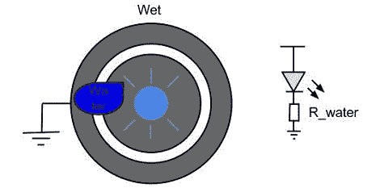

# 克隆水基轻质墙项目

> 原文：<https://hackaday.com/2012/08/22/cloning-a-water-based-light-wall-project/>

几周前，我们展示了这个基于水的 LED 涂鸦艺术装置，它允许任何人只用一瓶水就能在光线下作画。当[Chris]的一个朋友看到这个构建的视频时，他立即问他它是如何工作的。事情一件接一件，现在[克里斯]和波士顿大学 BUILDS hackerspace 的其他几个成员正在建造他们自己的[水 led 装置](http://happyrobotlabs.com/posts/project/water-led-art-making-leds-light-up-with-water/)。

这种构建的基本前提是让水充当 LED 阳极和阴极之间的导体。如果不在电路上喷洒或涂抹水，LED 的两个引脚之间会有一个无穷大的电阻，电流无法流动。在阳极和阴极垫上施加水后，少量电流通过水传导，LED 点亮。

现在，[Chris]正在开发一个测试板，上面有不同大小的衬垫和间距，以便为他未来的构建获得最佳的水涂鸦 LED 效果。计划是用 100 块 10 厘米 x 10 厘米的板子通过跳线连接在一起，构建一个一米长的面板。

[Chris]的所有工作都在 GitHub 上[完成，尽管[Chris]还没有开始设计生产板，但如果你想要自己的水 LED 绘画面板，这已经足够让你开始了。](http://github.com/cwoodall/builds-water-leds)