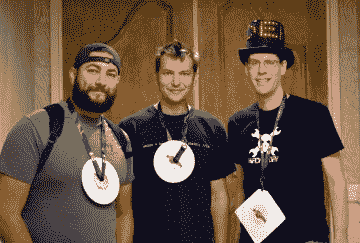
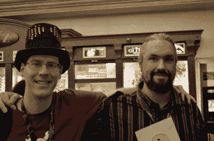
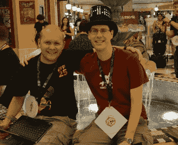
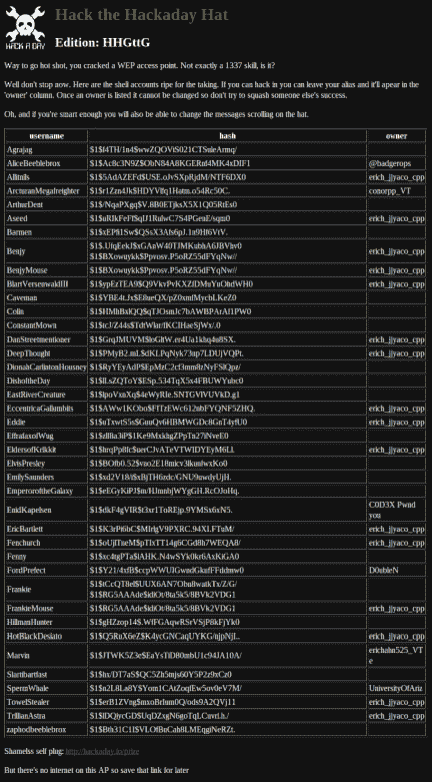

# 关闭 DEF CON 23

> 原文：<https://hackaday.com/2015/08/14/closing-out-def-con-23/>

上周我们在国防会议上玩得很开心。以下是对所发生的一切的回顾。

对我们来说，庆祝活动以周日早上的早餐聚会结束。通常我们会找一个酒吧，让人们在晚上聚集在一起，但是在这个会议上有太多的聚会(官方的和非官方的)，我们不希望人们不得不在它们之间进行选择。相反，我们让人们摆脱宿醉，及时起床参加上午 10:30 的活动。

我们有一个很棒的团队，他们中的许多人都带了硬件。【TrueControl】把今年威士忌海盗徽章的硬件和软件设计全部泄露了。这是迄今为止我最喜欢的非官方徽章……我发了一个帖子涵盖了我在周末能找到的所有徽章。

我们接待了大约 30 人，其中许多人逗留了两个小时。非常感谢 Hackaday 的母公司 Supplyframe 为我们提供早餐，并为 Hackaday 的工作人员提供这样的旅行。

### 帽子黑客

  @RobertPlacencia and Jason were the first at DEF CON 23 to hack  @noahanadeau was the second on the scoreboard    

我为 DEF CON 22 制作了一顶可以滚动消息的帽子，同时也是一个简单的基于 WiFi 的加密游戏。登录接入点，尝试加载任何网页，你会看到上面显示的记分牌。破解任何一个哈希，你就可以登录帽子，把你的名字放在记分牌上，让帽子说任何你想说的话。

去年[只有一个人黑掉了帽子](http://hackaday.com/2014/08/21/hat-hash-hacking-at-defcon/)，今年记分牌上有 7 个名字，总共有 22 个被破解的散列。干得好！

*   erich_jjyaco_cpp 16 帐户
*   UniversityOfAriz 1 帐户
*   @badgerops 1 帐户
*   conorpp_VT 1 帐户
*   C0D3X Pwnd 您 1 个帐户
*   1 号账户
*   erichahn525_VTe 1 帐户

这些黑客中有三个和我谈过，其他四个对他们的黑客行为讳莫如深。最佳射手使用一个 shell 脚本自动用破解的密码登录，并把他的名字放在记分牌上。

我真的想明年改变它。也许是三个人戴的三顶帽子，其中包含了某种类型的三部分钥匙，以增加不同的挑战。如果你有任何想法，我很乐意在下面听到，或者作为对项目页面的评论。

### 在 socketCAN 上

我非常喜欢的一个“乡村”演讲来自于(Eric Evenchick)。他在这里当了几年作家，但是他严肃的工程生活占用了他越来越多的时间——这对他有好处！

你可能还记得[他开发的用于开源汽车黑客的工具](http://hackaday.com/2015/03/28/speaking-can-with-open-source-hardware/)。从那时起，他就到处发表演讲。这包括今年早些时候的 Blackhat Asia(这里是[的幻灯片](https://www.blackhat.com/docs/asia-15/materials/asia-15-Evenchick-Hopping-On-The-Can-Bus.pdf)，以及 DEF CON 前几天在 Blackhat 的一次演讲。

这个乡村演讲与那些不一样，相反他集中展示了 socketCAN 的能力以及如何在你自己的黑客活动中使用它。这是一个开源软件套件，在 Linux repos 中。它提供了一系列工具，让你监听 CAN 数据包，记录它们，并把它们发送到你自己的车上。听到[Eric]一口气说出每一个都有用的例子真是太好了。

## 我们在 DEF CON 23 上的帖子

如果你错过了其中的任何一个，这是我们对会议的报道。我们玩得很开心，期待明年在那里见到大家！

*   [帮助破译 DEF CON 徽章](http://hackaday.com/2015/08/06/help-decipher-the-defcon-badge/)
*   [DEF CON 优步徽章热到有放射性](http://hackaday.com/2015/08/07/def-con-uber-badge-so-hot-its-radioactive/)
*   [DEF CON:Proxy ham 的代理](http://hackaday.com/2015/08/07/def-con-the-proxy-for-proxyham/)
*   [科利·多克托罗指责 DRM 和 DMCA 的影响](http://hackaday.com/2015/08/08/corey-doctorow-rails-against-the-effect-of-drm-and-the-dmca/)
*   [DEF CON:滥用多人游戏脚本](http://hackaday.com/2015/08/08/def-con-abusing-scripts-in-multiplayer-games/)
*   [入侵 KVM:教键盘开关监视](http://hackaday.com/2015/08/08/hacking-a-kvm-teach-a-keyboard-switch-to-spy/)
*   [DEF CON: HDMI CEC Fuzzing](http://hackaday.com/2015/08/09/def-con-hdmi-cec-fuzzing/)
*   [DEF CON 的所有非官方电子徽章](http://hackaday.com/2015/08/10/all-the-unofficial-electronic-badges-of-def-con/)