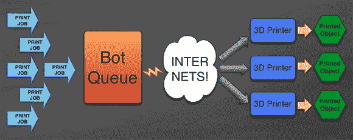

# 3D 打印机机群的云支持

> 原文：<https://hackaday.com/2013/03/13/cloud-support-for-fleets-of-3d-printers/>

3D 打印机比以往任何时候都更多地被用于小型原型和生产运行，使用 3D 打印机和单个桌面应用程序的正常方式变得越来越过时。[Zach 'Hoeken' Smith]有一个解决打印多个对象的挫折的方法:[它被称为 BotQueue](http://www.hoektronics.com/2012/09/13/introducing-botqueue-open-distributed-manufacturing/) ，允许任何人通过互联网向多台 3D 打印机提交打印作业。

僵尸队列背后的想法是允许任何人通过互联网向 3D 打印机发送作业。支持队列和多台打印机，这意味着小规模制造对于处理多台打印机的人来说变得容易多了。

我们已经看到[一些 3D 打印机群](http://hackaday.com/2012/08/23/help-us-decide-if-this-huge-reprap-array-is-the-largest-fleet-to-date/)可以从多台 3D 打印机的在线打印服务器中受益。这不是一个适合所有人的项目——每人一台 3D 打印机应该足以满足所有人的需求——但如果你是拥有几台打印机的黑客空间的一员，我们可以看到这在你的同行制造商中发挥了巨大的作用。你也不局限于使用官方的僵尸队列服务器。你可以[从【扎克】的 git](https://github.com/Hoektronics/BotQueue) 运行你自己的僵尸队列