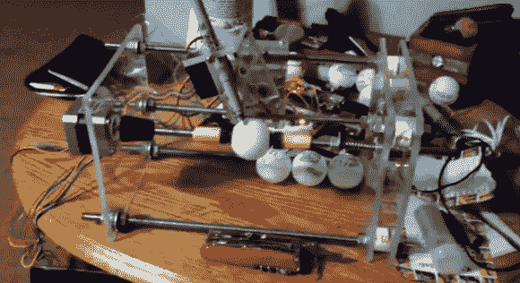

# 数控乒乓打印机使用简单的结构

> 原文：<https://hackaday.com/2013/03/24/cnc-ping-pong-printer-uses-simple-construction/>

这是我们见过的最简单的 CNC 构建之一，但它仍然运行得很好。它是 EggBot 的克隆体，但目标是打印球形乒乓球，而不是椭圆形鸡蛋。[Chad]称它为 Spherebot，但你应该小心不要把它和[变形球形机器人](http://hackaday.com/2012/04/02/sphere-morphing-hexabot-now-rolls-around)混淆，后者可以像六足动物一样四处走动。

这个项目在机械和电子方面都很简单。打印机的主体由三块丙烯酸板组成，我们确信这些板在钻孔时被夹在一起，以确保正确对齐。螺纹杆和螺母用于将板安装在一起，并在印刷时将球体固定在适当的位置。一个步进电机转动球，而另一个转动笔座。伺服电机负责提起笔。整个系统由一个 Arduino 和两个步进电机驱动板驱动。不要错过休息后嵌入的[Chad]演示。

[https://www.youtube.com/embed/clCYiYnZ_nw?version=3&rel=1&showsearch=0&showinfo=1&iv_load_policy=1&fs=1&hl=en-US&autohide=2&wmode=transparent](https://www.youtube.com/embed/clCYiYnZ_nw?version=3&rel=1&showsearch=0&showinfo=1&iv_load_policy=1&fs=1&hl=en-US&autohide=2&wmode=transparent)

[via [Reddit](http://www.reddit.com/r/arduino/comments/1asson/spherebot_completed/)