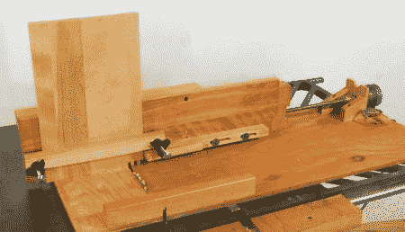

# 数控台锯夹具

> 原文：<https://hackaday.com/2012/07/03/cnc-table-saw-jig/>

[【woodgears . ca】](http://woodgears.ca/ "Woodgears")似乎是一个聪明的黑客财富，这个[数控盒接头夹具](http://woodgears.ca/box_joint/computer_jig.html "CNC box joint jig")也不例外。尽管必须手动移动夹具来进行实际切割，但它仍然为用户提供了许多额外的功能。人们只需点击鼠标按钮来推进工件。使用台锯的一个缺点是，即使使用这种夹具，一些内部零件仍然可能必须被切割。休息后查看视频，看看这个设备的运行情况，或者跳到 3:08 左右，看看还有哪些手部操作需要完成。

除了是一个很酷的建筑，我们还喜欢盒子连接的电子工程外壳。由于这是在 2003 年制作的，很高兴看到“自我复制”(至少是部分自我复制)的想法并不是从[【Rep-Rap】](http://reprap.org/wiki/RepRap "RepRap")开始的。10 岁(截至 2003 年)的 Thinkpad 笔记本电脑在 DOS 下运行 QBasic 是一个很好的“黑客”接触，因为它使用 100 瓦的灯泡作为电源电阻。非常聪明的电子产品，特别是对于一个以他出色的木工技术而不是明显的电气工程知识而闻名的人来说！T3T5