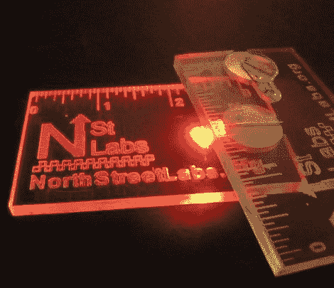

# 数控的名片一定会让你注意到

> 原文：<https://hackaday.com/2012/04/08/cncd-business-cards-will-definitely-get-you-noticed/>

在北街实验室的家伙们感到无聊，所以他们想为什么不继续下去，建立一个数控机床只是为了好玩。虽然他们还没有在 CNC 上张贴制造细节，但他们确实有一些新磨出的名片来展示这台机器的工作情况。

一半是统治者，一半是领导者，我们认为他们的新名片看起来很棒。他们的卡片由薄的丙烯酸薄片磨制而成，上面有 North Street Labs 的标志和 URL，以及 1/32 英寸的标尺标记。该卡还配有纽扣电池和 RGB LED 的空间，从侧面照亮整个卡。

他们说制作每张卡片大约需要 5 分钟，这一点也不差。每张 0.50 美元，这些卡片远不如用卡片纸制成的卡片便宜，但是当你想要给人留下深刻印象时，几个 25 美分的硬币又有什么用呢？

继续阅读，看看他们的数控加工名片的短片。

[vimeo http://vimeo.com/39917579 w=470]