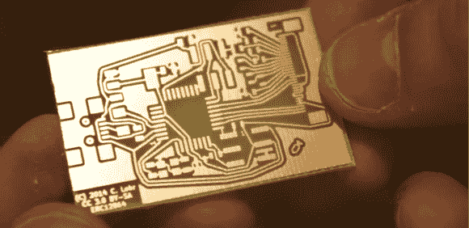

# [CNLohr]演示他的光刻 PCB 工艺

> 原文：<https://hackaday.com/2014/01/31/cnlohr-demos-his-photoetch-pcb-process/>

如果你想学点什么，只有向大师学习才有意义。[CNLohr]在这些地区以他的传奇 PCB 而闻名，他的[最终开始记录他的整个制造过程。](http://www.youtube.com/watch?&v=CnIKviw3szM)

[CNLohr]使用的是光刻工艺，用激光打印机在透明胶片上制作掩模。他用 Riston 光敏掩模覆盖覆铜板——此处[可用](http://www.tech-place.com/en/11-photosensitive-materials)，它们接受比特币——通过层压机发送，用激光印刷掩模和 UV grow 灯泡曝光。掩模显影后，[CNLohr]将他的电路板放入氯化铁浴中，它会腐蚀掉未曝光的铜。然后，他用丙酮去除光掩模，用一对飞机剪刀切割电路板，它们就可以与元件焊接在一起了。

是的，家用 PCB 蚀刻教程基本上是一个已经解决的问题，但是[CNLohr]的工作本身就说明了问题。他也是在玻璃显微镜载玻片上做了一个[微控制器/Linux/《我的世界》东西](http://hackaday.com/2013/02/18/cnlohrs-microscope-slide-linux-avr-minecraft-thing/)的家伙。向拥有这些技能的人学习意味着你在向最好的人学习。

下面的视频，还有一个使用 KiCAD(！)和 [TopoR](http://www.toporouter.com/) (！！！)[此处可用](http://www.youtube.com/watch?&v=CnIKviw3szM)。

[https://www.youtube.com/embed/pbYDQuALOeY?version=3&rel=1&showsearch=0&showinfo=1&iv_load_policy=1&fs=1&hl=en-US&autohide=2&wmode=transparent](https://www.youtube.com/embed/pbYDQuALOeY?version=3&rel=1&showsearch=0&showinfo=1&iv_load_policy=1&fs=1&hl=en-US&autohide=2&wmode=transparent)

[https://www.youtube.com/embed/CnIKviw3szM?version=3&rel=1&showsearch=0&showinfo=1&iv_load_policy=1&fs=1&hl=en-US&autohide=2&wmode=transparent](https://www.youtube.com/embed/CnIKviw3szM?version=3&rel=1&showsearch=0&showinfo=1&iv_load_policy=1&fs=1&hl=en-US&autohide=2&wmode=transparent)