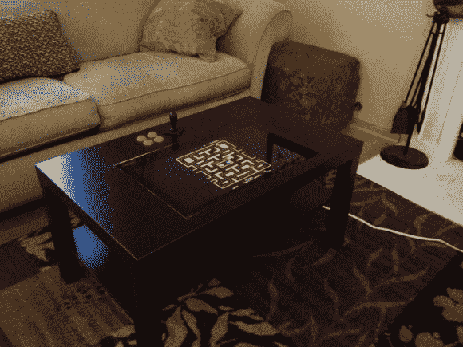

# 咖啡桌拱廊橱柜

> 原文：<https://hackaday.com/2013/01/15/coffee-table-arcade-cabinet/>

坐在这张沙发上享受吃豆人游戏，这要感谢咖啡桌内置的街机装备。控制比[更专用的 MAME 装备](http://hackaday.com/2013/01/08/star-wars-themed-mame-cabinet-is-perfect-in-this-basement-bar/)稍微稀疏一些，但是你仍然可以用四个按钮和一个操纵杆玩大多数经典游戏。毕竟，当你不玩游戏时，你需要预留一些空间来搁脚。

[Manny Flores]从宜家的 Lack 拉克餐桌开始了这个项目。顶部一点也不结实。在描绘了 LCD 屏幕的轮廓并切开表面后，他发现这与其说是木头，不如说是硬纸板。桌子表面的蜂窝纸板可以轻松腾出一些空间。事实上，当需要添加街机按钮时，他只是用一把美工刀来切割开口。在里面你会发现一个树莓 Pi，它通过 iPac USB 控制器板与按钮和操纵杆连接。安装在底部的一组有源扬声器完善了设计。

[途径 [Adafruit](http://www.adafruit.com/blog/2013/01/11/lack-arcade-coffee-table-piday-raspberrypi-raspberry_pi/)