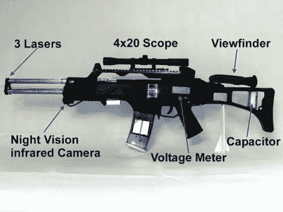

# 装在气枪枪套里的激光瞄准器

> 原文：<https://hackaday.com/2012/09/14/coilgun-with-laser-sights-built-in-an-airsoft-rifle-housing/>

这款 [coilgun 最初是一款库存气枪](http://www.doityourselfgadgets.com/2012/09/g36-coilgun.html)。库存武器的成本约为 40€(略高于 50 美元)，但我们认为这是非常值得的，因为它为所有的线圈炮组件提供了足够的空间，并解决了大部分的机械问题，如舒适的握持身体，触发器等。

用作枪管的透明管(与我们在[该钢卷导杆](http://hackaday.com/2012/09/13/simple-concepts-behind-complex-coilguns/)中看到的设置相同)受到三个不锈钢枪管的保护。他们每个人都有一个激光二极管，这导致了一个*捕食者*风格的瞄准机制，在休息后的视频中展示。甚至还有一个夜视系统，使用红外发光二极管和取景器连接到股票。

一个相机闪光灯被废弃为内部的变压器。它充当电压发生器，给一些电容充电。它似乎没有问题产生足够的电力来工作，尽管事实上它只由安装在杂志上的两节 AA 电池供电。

[https://www.youtube.com/embed/shw4lLI45U0?version=3&rel=1&showsearch=0&showinfo=1&iv_load_policy=1&fs=1&hl=en-US&autohide=2&wmode=transparent](https://www.youtube.com/embed/shw4lLI45U0?version=3&rel=1&showsearch=0&showinfo=1&iv_load_policy=1&fs=1&hl=en-US&autohide=2&wmode=transparent)