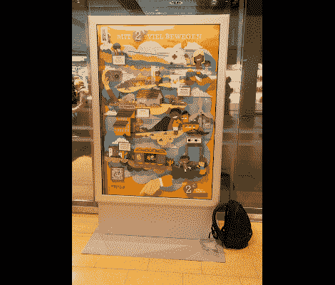

# 基于硬币的鲁比·戈德堡帮助募集捐款

> 原文：<https://hackaday.com/2012/08/21/coin-based-rube-goldberg-helps-bring-in-donations/>

这个信息亭被设计成一个互动海报，帮助一个德国救援组织筹集捐款。这件作品不仅提供了一个硬币罐，还上演了一场小表演，将一枚两欧元的硬币从顶部的投币口运送到底部的储藏库。一路上，许多部分都在移动，以鲁布·戈德堡的方式讲述着一个故事。

让我们感到惊讶的是，这看起来多么像我们自己的项目之一——至少在展示被绘制的这一点上是如此。上面的链接展示了一些发展阶段的图片。原型在一块形状奇特的胶合板上成形，硬币的路径被标了出来。在从 A 点到 B 点的旅行细节建立之后，空白的空间被填充以增加视觉趣味。如果你看一眼胶合板的背面，你会看到满满的原板和垂挂的电线。相机、Mac Mini 和 Dropbox 被混合在一起，在该组织的脸书页面上分享捐赠者的图像(当然是在捐赠者同意的情况下)。

今年早些时候，这件作品在汉堡机场展出了一个月。看看休息后的视频片段。

[https://www.youtube.com/embed/DsxR4wr9NtY?version=3&rel=1&showsearch=0&showinfo=1&iv_load_policy=1&fs=1&hl=en-US&autohide=2&wmode=transparent](https://www.youtube.com/embed/DsxR4wr9NtY?version=3&rel=1&showsearch=0&showinfo=1&iv_load_policy=1&fs=1&hl=en-US&autohide=2&wmode=transparent)