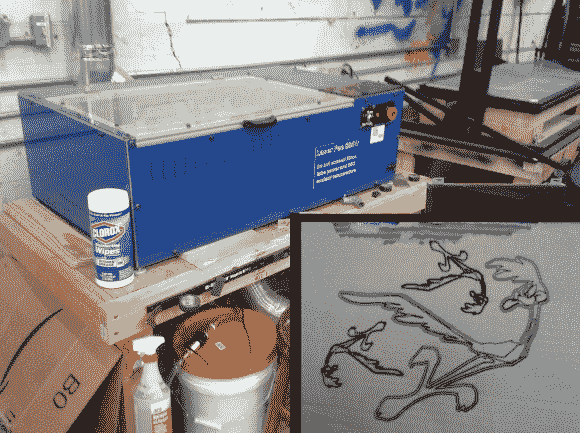
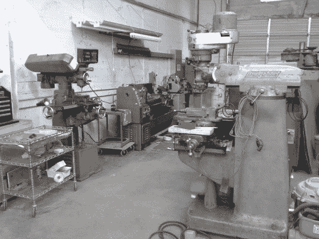
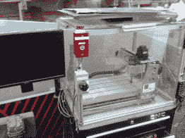
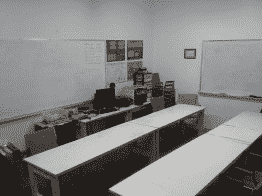
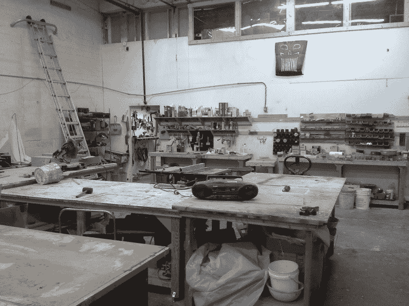

# 亚特兰大黑客空间免费热线电话

> 原文：<https://hackaday.com/2014/06/21/cold-call-pop-in-to-the-freeside-atlanta-hackerspace/>

我最近莫名其妙地去了乔治亚州。这是我第一次去乔治亚州，那里很热，真的很热，我也不太习惯。那里的路况也很好，还有一些我不习惯的地方。在那里的时候，我确实有一些空闲时间，所以我跳上 hackerspaces.org 去看看周围有什么。有几个地方在开车的距离内，但在我有空的时候，亚特兰大自由城是唯一一个开放的地方。这是我决定停下来的唯一原因，我很高兴这发生了，因为我过得很愉快。

进入后不久，一位成员，我的新朋友史蒂文向我打招呼，他原来是这个团体的主席。寒暄过后，史蒂文开始带我四处参观。我的第一印象是这个地方很吸引人。它看起来很大，而且很少杂乱。有很多桌子可以用来做你的项目，架子上放着零部件。这些备件没有堆在货架上，而是放在标有内装物品的盒子里。我喜欢这个，因为它整洁，而且很容易找到你要找的东西。我从经验中知道，在社区工作室环境中保持这种级别的组织是很难的。

回到这次旅行，我被带到了一个单独的专用教室，里面有 16 名学生，还有写字板。当我们继续进入这个空间时，我经过了一些开放的工作区和桌子。再往前走一点，厨房旁边有一个休息区，那里有沙发和一个巨大的投影屏幕，我在那里享用了一些会员烘焙的饼干。那时我以为我已经看到了整个空间，但我错了，在我以为是后墙的地方还有一扇门。那是商店区的入口。

空间的前部相当大，商店至少一样大。我后来发现整个地方大约有 5500 平方英尺。他们有一个相当不错的木工车间，里面有工作台、台锯、斜切锯、刨床等，更不用说大量的手工和电动工具了。再往前走一点，有一家金属商店，里面有磨坊、车床和电焊工。还有一个切割零件的小型数控刳刨机。如果到目前为止这还不够，还有一个二氧化碳激光切割机，这是我在参观中最喜欢的部分…

激光切割机是开源的[buildlog.net 2 号。X](http://www.buildlog.net/blog/2011/02/buildlog-net-2-x-laser/) 。这是我参观中最喜欢的部分，因为我得到了一对一的激光工作流程课程，使用 [CAMBAM](http://www.cambam.info/downloads/) 从 DXF 文件生成 g 代码，通过 [Mach3](http://www.machsupport.com/software/mach3/) 运行 g 代码，通过并行端口将步进/方向/激光信号发送到激光切割机控制板。我们开始将纸板切割成简单的形状，但后来我开始在纸板上刻录一些路行者的图像。我的伤口可能不是世界上最令人印象深刻的东西，但我个人学到了很多，并可以在未来应用这些知识。作为黑客空间的一员，向他人学习是一个巨大的好处。

在展示激光的时候，我注意到了一些现在对我来说非常明显的东西:贴在机器上的基本说明。它只有一页长，但有如何打开激光、设置激光、运行程序以及如何关闭激光的一般说明。我可以看到像这样非常简单的东西对任何拥有半复杂/昂贵设备的黑客空间来说都是一个巨大的好处。第二课！

我学到了很多东西，我很高兴我至少能在那里帮上一点忙。我参与建立了一个新的工作区。这个小组收到了一些旧的实验桌。你还记得高中科学课上的这些，沉重的木制橱柜，沉重的耐化学腐蚀的石头工作表面。他们很适合这个空间，我相信他们会有很多用处。

这个地方发生了太多的事情，我无法一一详述。值得一提的是，还有一个 3D 打印区，包含 3 台工作打印机，随时可以打印出您的下一个项目。有专门的房间存放成员项目/零件。我确信这有助于保持其余的公共区域没有垃圾。如果你喜欢业余无线电或者制作播客，有一个小房间可以满足你。当我在那里的时候，一些成员正在建立一个媒体实验室和生物实验室。从我的角度来看，我遇到的成员都很活跃，都参与到了“空间”中。毫无疑问，这个团体有他们的东西在一起。如果你曾经在这个地区，我建议停下来。

回家后，我注意到这些年来亚特兰大自由区已经出现了好几次。卡莱布·卡夫和【[乔希·马什](http://hackaday.com/2013/10/14/adventures-in-hackerspacing-freeside-atlanta-part-i/)都曾到访过。也有一些帖子是关于 Freeside 成员如何制作[无限门户](http://hackaday.com/2013/11/08/freesides-infinity-portal/)和[日出模拟闹钟](http://hackaday.com/2011/10/01/a-sunrise-clock-for-those-cold-dark-winter-mornings/)的。

  Machine Shop  Small mill  Classroom area  Wood Shop