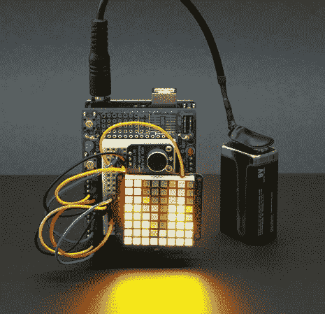

# 彩色 LED 矩阵 VU 计显示如何使用与 Arduino FFT

> 原文：<https://hackaday.com/2012/11/30/color-led-matrix-vu-meter-shows-how-to-use-fft-with-arduino/>

如果你曾经想制作自己的 VU 计，但被信号处理过程吓退了，你需要学习这篇教程。

Hackaday 校友[Phil Burgess]使用 RGB LED 矩阵、麦克风和 Arduino 开发了这款设备。你会注意到它不包括我们在大多数这类项目中看到的 MSGEQ7 芯片。我们已经看到[一些使用快速傅立叶变换](http://hackaday.com/2011/01/08/pic-spectrum-analyzer-uses-fast-fourier-transform-routine/)来映射显示器上的音频信号，就像这个一样。但是[菲尔]选择了[一个用于 ATmega 芯片的汇编语言库](http://elm-chan.org/works/akilcd/report_e.html),这使得将它整合到你自己的项目中变得非常简单。

硬件选择的一个缺点是只有 8 位垂直分辨率。这需要一点创造性的解释，使这个看起来很好，但颜色混合的使用确实有所不同。休息后在演示中自己看吧。

[https://www.youtube.com/embed/Tmpl5KA02S4?version=3&rel=1&showsearch=0&showinfo=1&iv_load_policy=1&fs=1&hl=en-US&autohide=2&wmode=transparent](https://www.youtube.com/embed/Tmpl5KA02S4?version=3&rel=1&showsearch=0&showinfo=1&iv_load_policy=1&fs=1&hl=en-US&autohide=2&wmode=transparent)

[感谢 PT]