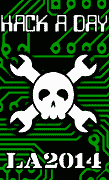

# Hackaday:聚会

> 原文：<https://hackaday.com/2014/01/06/come-build-the-hackaday-community/>

[**2014 年 1 月 21 日——洛杉矶市区**](http://www.eventbrite.com/e/hackaday-party-la2014-tickets-10018045243)
来一个吧，和[布莱恩]、我以及住在洛杉矶地区的 Hackaday 读者们一起参加一个派对。门票是免费的，还有啤酒、食物、t 恤衫、贴纸和其他只有你亲自到场才能发现的东西。

这是第一次正式的现场 Hackaday 聚会，对所有年龄的人开放。今年夏天，我们讨论了如何让 Hackaday 成为一个虚拟的黑客空间，而这个活动就是这个计划的一部分。我们会让你知道一些我们正在计划的事情，但作为回报，我希望你能告诉我们你对如何让 Hackaday 社区变得更大更好的想法。我们还利用这个活动的出席率来判断我们是否应该举办更多的现场活动(可能也在其他城市)。所以，如果你在洛杉矶，现在就买票，并确保你的朋友也买票。

**更新 3:** 让你的名字出现在等候名单上……

仅用了 24 个多小时就把 450 张票全部发完了。但是不要害怕，你仍然可以通过上面的链接把你的名字添加到等候名单中。如果任何已经注册的人改变了主意，他们可以释放他们的票，它将提供给等候名单上的任何人。

**更新二:**圣牛，我们吹透了 300 张票。但是我们发布了更多。现在得到你的，然后继续阅读下面。

多么狂野的旅程！我最初的计划是提供一周的早鸟票，然后如果我们需要的话，再发行更多。但是我们在大约 10 个小时内把 300 个都用完了。这会很棒的。我们真的很想打包房子，所以我已经发布了额外的 150 张“保留”票。这两张票没什么区别，但这真的是我们仅剩的了，所以现在就去买你的吧！

**更新 1:** 仅仅 3 个多小时，我们就送出了 100 多张门票！