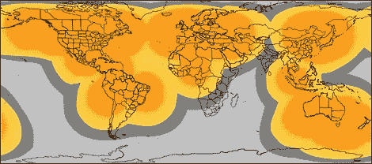

# 通过点连接从任何地方进行通信

> 原文：<https://hackaday.com/2012/04/17/communicating-from-anywhere-with-a-spot-connect/>

Sparkfun 上的[Nate]发布了一个很棒的教程，教你如何用任何微控制器使用 [SPOT 个人卫星通信器](http://www.sparkfun.com/tutorials/340)。这些个人卫星发射器最初是为了与智能手机的蓝牙模块配对，允许您从世界任何地方发送 41 个字符的短消息。现在，你可以用这些小巧的盒子从遥感器中获取数据，甚至是气象气球的遥测数据。

[内特]的拆卸扩展了[ [钠 42/a > ]和 [特拉维斯·古斯比](http://travisgoodspeed.blogspot.com/2011/12/introduction-to-bluetooth-rfcomm.html) ]在逆向工程 SPOT 卫星通讯器方面的努力。硬件与[全球之星](http://en.wikipedia.org/wiki/Globalstar)卫星星座一起工作，仅用于上行链路。也就是说，你不能发送东西*到*一个有 SPOT 的远程设备。在摸索了最初的第一版 SPOT 的电路之后，[Nate]从他的魔术包中拿出了一个便宜得多的 [SPOT Connect](http://www.findmespot.com/en/index.php?cid=116) 。像以前的黑客一样，接入蓝牙 TX/RX 线路赋予了[Nate]向轨道上的卫星广播任何他想广播的内容的完全权限。

我们已经看到 SPOT 卫星信息服务在北加州荒野上空的高空气球上投入使用，在那里它被证明是一种非常可靠的数据收集手段，尽管价格昂贵。不过，有时候 XBees 和地面无线电*不够好*，你需要一个卫星解决方案。

SPOT 卫星服务有一个巨大的覆盖区域，见这篇文章的标题图片。唯一没有被覆盖的主要大陆是东部和南部非洲、印度和南美洲的南端。如果有人想建造一架跨大西洋的无人机，SPOT 和[Nate]的精彩教程是可以使用的工具。

向[MS3FGX]致敬，感谢他送来这封信。