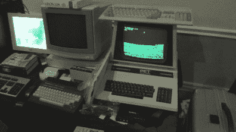
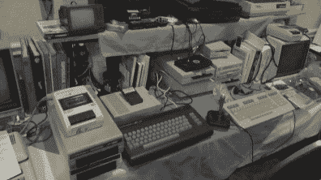
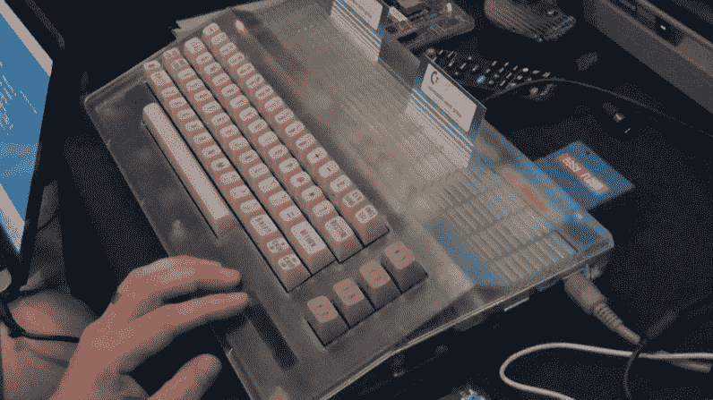
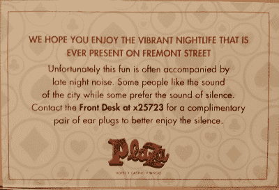

# CommVEx 2015:Commodore 用户聚集时会发生什么

> 原文：<https://hackaday.com/2015/07/28/commvex-2015-what-happens-when-commodore-users-gather/>

我不再年轻了，事实上我正在一天天变老。这个事实以及今年是 Commodore C-128 和最初的 Commodore Amiga 的 30 周年纪念日的事实促使我参加今年在拉斯维加斯举行的 CommVEx，以免我无法参加下一个重要的周年纪念日。对于那些不认识我的人来说，我在 1984-85 年 25 岁的高龄设计了 C-128，尽管我想请你们不要因为这是很久以前的事而反对我。

也是在这一年，Commodore 的创始人杰克·特拉米尔的儿子伦纳德·特拉米尔博士能够参加这一史无前例、令人难忘的活动。

[https://www.youtube.com/embed/PHmHRW6cX2I?version=3&rel=1&showsearch=0&showinfo=1&iv_load_policy=1&fs=1&hl=en-US&autohide=2&wmode=transparent](https://www.youtube.com/embed/PHmHRW6cX2I?version=3&rel=1&showsearch=0&showinfo=1&iv_load_policy=1&fs=1&hl=en-US&autohide=2&wmode=transparent)

作为弗雷斯诺 Commodore 用户组的演讲者，我的大部分时间都在努力克服时差，思考我要讲的内容，并试图在街对面的现场乐队演奏到凌晨 2:00(我的时间是早上 5:00)时小睡片刻

在第二天的某个时候，我想起了我的相机，完全不顾稳定和白平衡设置，我开始和一些与会者聊了起来。

我必须警告你，除非你是一个老准将球迷或 8 位的东西的爱好者，你可能会想跳过左右。这是一张带有时间代码的精彩片段图表:

*   0:30 被 CBM 压碎
*   1:30 C128D 门奖
*   2:20 又一个 C128，带驱动仿真器
*   3:38 C128 复活节彩蛋
*   5:00 准将中层管理人员被改造成一只会说话的毛绒狗
*   8:30 SX 准将 64 可运输的 C-64
*   10:00 大热门
*   11:45 用于 CBM 的驱动器和外设仿真器
*   13:57 保存旧游戏/软件
*   15:00 摆满 CBM 设备的桌子
*   17:30 旧 C64、C-64C 和新 kickstarter 外壳

      

我不得不说，我很惊讶有人还记得这些旧电脑，他们花时间使用，甚至继续为它们开发代码。我也很惊讶这些老恐龙还能工作，这在 1980 年代中期我是不会想到的。

What you don’t want to find after you have checked into your hotel room.