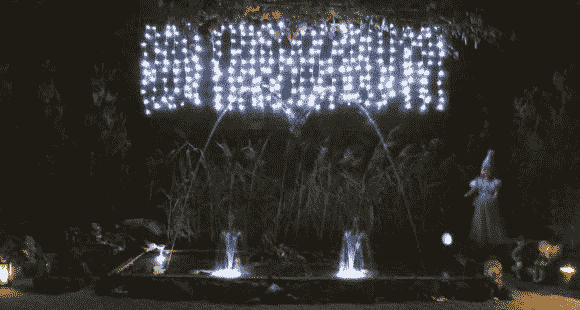

# 电脑控制的水上表演

> 原文：<https://hackaday.com/2013/10/07/computer-controlled-water-show/>

在看到我们最近关于层流喷嘴的帖子后，[Richard]决定与我们分享他家的夏季项目——[一个电脑控制的水秀](http://www.aquavena.nl/de-techniek/) ( [翻译](http://translate.google.com/translate?sl=auto&tl=en&js=n&prev=_t&hl=en&ie=UTF-8&u=http%3A%2F%2Fwww.aquavena.nl%2Fde-techniek%2F&act=url))！

该设置使用树莓 Pi 作为其核心，并使用一组 USB 中继板来根据音乐打开和关闭阀门和灯。他们用 Python 写了这个程序，并把它发布在他们的网站上分享。

他们使用常见的家用电磁阀，因为它们易于通过继电器控制，但不幸的是，它们只能开/关，因此不可能实现可变流量。他们遇到的一个挑战是均衡水压——一是确保喷泉关闭时水泵不会过热，二是均衡每个喷泉流的高度。为了解决这个问题，他们为泵使用了一个压力调节器，并通过额外的控制阀来组织管道，使压力差最小。

这个装置听起来没那么贵，现在这家人在他们的花园里有了他们自己的音乐启动喷泉——多棒啊！休息后留下来看看它的运行。

[https://www.youtube.com/embed/CnRhRf4VDf8?version=3&rel=1&showsearch=0&showinfo=1&iv_load_policy=1&fs=1&hl=en-US&autohide=2&wmode=transparent](https://www.youtube.com/embed/CnRhRf4VDf8?version=3&rel=1&showsearch=0&showinfo=1&iv_load_policy=1&fs=1&hl=en-US&autohide=2&wmode=transparent)

这里是[我们上面提到的最近的层流喷嘴项目](http://hackaday.com/2013/10/05/a-laminar-flow-nozzle/)的链接。也许作为未来的升级，他们可以从这些层流射流[中获得一些想法，使这些射流的行为更像光纤！](http://hackaday.com/2012/07/24/create-a-laminar-flow-jet-wthout-pesky-fiber-optics/)