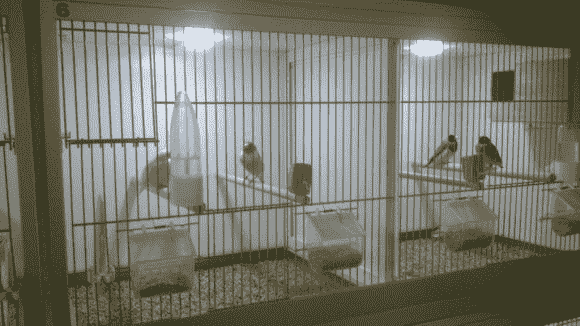

# 用这个日光模拟系统迷惑鸟儿

> 原文：<https://hackaday.com/2014/02/26/confuse-the-birds-with-this-daylight-simulation-system/>

黑客喜欢挑战。因此，当[Patrick]的岳父要求他为他的鸟笼研究一个日光模拟系统时，[Patrick]很快发现了商业系统的荒谬价格…所以他说服岳父让他设计并建造一个。

像任何项目一样，[Patrick]在开始任何事情之前，很快列出了系统的需求。

*   早晨天一定会逐渐变亮
*   全天保持不变
*   傍晚昏暗到很低的强度

除此之外，灯光过渡应该平滑，灯光不能闪烁，因为这对鸟类来说可能是压力——哦，它需要可靠。

为了构建这个系统，[Patrick]选择了一个 Arduino Duemillenova、一个 RTC、一个小型 LCD 屏幕、一些来自易贝的廉价 led 和一些 N 沟道 NPN 晶体管来为 led 提供 PWM。整个系统的成本不到 100 美元——比商业系统便宜得多。

我们认为这个系统看起来很棒，但是作为 Hack a Day 社区的忠实粉丝，[Patrick]希望听到您的反馈！