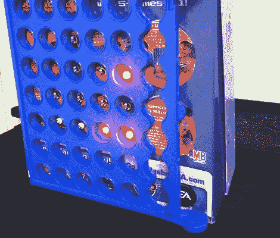

# 连接 4 个二进制时钟

> 原文：<https://hackaday.com/2012/08/15/connect-4-binary-clock/>

作为大学课程的一部分，[Emacheen22]和他的队友[将一个旧的 Connect 4 游戏变成了一个二进制时钟](http://www.instructables.com/id/Connect-4-Binary-Clock)。这张图片显示了接近完成的设备，但最终的构建包括了扩散 LED 光的游戏令牌。我们喜欢这个概念，但认为有一些方法可以在下一次迭代中改进它。如果你有兴趣自己制作，我们打赌你可以在旧货店找到 Connect 4。

该团队没有使用独立式游戏框架，而是决定使用盒子来容纳 led 并隐藏电子设备。由于他们使用试验板和 Arduino，这是一个很好的选择。但这意味着游戏框架需要侧放，因为如果没有塑料底座，代币就不会留在原位。他们为每个 LED 使用面板安装支架，并选择强力胶将所有部件粘在一起。

我们认为如果框架是直立的，这会很有趣。通过将引线热粘合到开口的任一侧，led 可以自由浮动。利用底座下的一个小盒子，所有的电子设备都可以隐藏起来。毕竟，如果你直接焊接，只使用一个裸露的 AVR 芯片，就没有那么多要隐藏的了。或者你可以发挥想象力，用[逻辑芯片代替 uC](http://hackaday.com/2011/01/16/binary-clock-using-logic-chips-and-mains-frequency/) 。