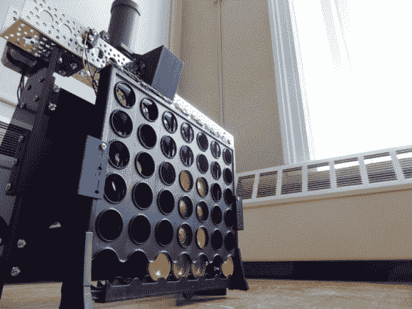

# 连接 4 个机器人在踢你屁股之前嘲弄你

> 原文：<https://hackaday.com/2014/07/07/connect-4-robot-taunts-you-before-kicking-your-butt/>

[Patrick McCabe]是麻省理工学院的一名学生，在他的微型计算机项目实验室课程的最后一个项目中，他决定制造一个聪明的 Connect 4 机器人。

该项目的唯一标准是，你必须使用赛普拉斯 PSOC 5LP 套件以及 8051 微控制器或等效物(用与 PSOC 相同的汇编语言编程)。总之，[Patrick]有 5 周的时间来完成这个项目。

他使用的是一款普通的老式 Connect 4 游戏和各种定制部件。步进电机使用同步带驱动代币托架来回穿过 15″的铝通道。伺服释放令牌，所有其他组件，支架和其他零件要么是用他自己的迷你 3D 打印机制作的，要么是用学校的激光切割机制作的。这是一个非常干净和经过深思熟虑的构建，他实际上已经将所有定制的零件文件(以 SolidWorks 格式)上传到网上，供其他人构建自己的文件。

也挺快的！

[https://www.youtube.com/embed/7uiPhECQtrs?version=3&rel=1&showsearch=0&showinfo=1&iv_load_policy=1&fs=1&hl=en-US&autohide=2&wmode=transparent](https://www.youtube.com/embed/7uiPhECQtrs?version=3&rel=1&showsearch=0&showinfo=1&iv_load_policy=1&fs=1&hl=en-US&autohide=2&wmode=transparent)