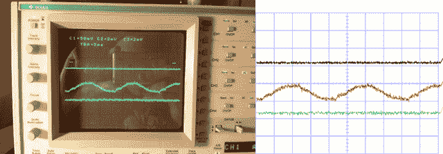

# 将旧示波器连接到计算机

> 原文：<https://hackaday.com/2013/08/25/connecting-an-old-scope-to-a-computer/>

[Michael]的一位朋友说，他的公司正在处理一些旧的实验室设备，并问他是否想要一台非常大、非常旧的数字存储示波器。“当然”，我们确信几杯啤酒下肚后，[迈克尔]在他的工作台上发现了一台老式古尔德 200 兆赫四频道示波器。即使在生产 20 年后，它仍然是一个功能强大的工具，但背面的串行端口让[Michael]想知道—[是否有可能在他的计算机上绘制示波器的屏幕？](https://acidbourbon.wordpress.com/2013/08/24/dso_linux/)

示波器背面有三个端口——GPIB、杂项 I/O 和 RS423。后一个端口与 RS232 非常相似，USB 转串行转换器可能会工作，在零调制解调器电缆和终端的帮助下，[Michael]能够连接到这个古老的示波器。

在手册中，[Michael]找到了适用于该示波器的串行命令。其中最有用的是一个命令，它将作用域跟踪内存的内容打印为一系列 1 字节的整数。通过一小段 PERL 编程，[Michael]可以创建一个显示在示波器屏幕上的任何东西的 PDF 绘图。它的格式非常适合 Gnuplot、MATLAB 甚至 Excel。

令人敬畏的工作，特别是有用的考虑到这些旧的范围正在慢慢地向某处的技术墓地前进。