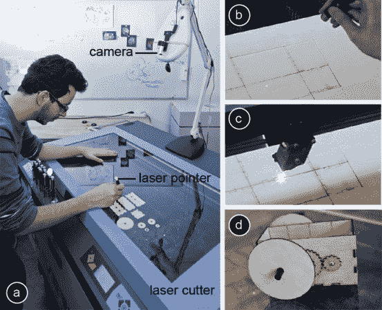

# 可构建:交互式激光切割

> 原文：<https://hackaday.com/2013/11/09/constructable-interactive-laser-cutting/>

你怀念过去不用电脑，手工制作东西的日子吗？你还记得真的用手画图吗？哈索·普拉特纳研究所人机交互小组的人提出了一个相当新颖的想法，通过激光笔结合手动输入，用激光切割机切割设计。听着耳熟？几天前，我们分享了同一批人的另一个关于[激光折纸](http://hackaday.com/2013/11/07/laser-origami/)的很酷的项目。

那到底是什么呢？这是一个交互式绘图表，可以从一个相当不精确的输入方法产生非常精确的物理输出。通过使用特定的激光笔，用户可以指示激光切割机在工件上切割、描绘或蚀刻图案。摄像机拾取激光指示器，然后软件通过拉直线条、连接圆点等方式对其进行清理。虽然只能由附带的视频确定这么多，但看到软件在切割设计时产生的效果还是很令人印象深刻的…我们真的无法想象它背后的编程！

在这和 [PACCAM:交互式 2D 零件包装](http://hackaday.com/2013/10/14/paccam-interactive-2d-part-packing/)之间，看起来激光切割将变得更加用户友好！休息后留下来看看它的运行，结果令人印象深刻！

[https://www.youtube.com/embed/8g3LaF9oVFY?version=3&rel=1&showsearch=0&showinfo=1&iv_load_policy=1&fs=1&hl=en-US&autohide=2&wmode=transparent](https://www.youtube.com/embed/8g3LaF9oVFY?version=3&rel=1&showsearch=0&showinfo=1&iv_load_policy=1&fs=1&hl=en-US&autohide=2&wmode=transparent)