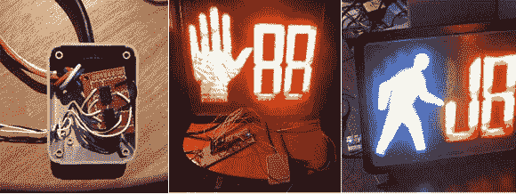

# 在线控制这个行人行走信号！

> 原文：<https://hackaday.com/2014/07/26/control-this-pedestrian-walk-signal-online/>

[Jon Bennett]是一名电子工程师，专门研究嵌入式系统软件。他是 Pebble Technology 的第一名员工，也是 inPulse 智能手表的首席开发者。他曾在滑铁卢大学学习，期间完成了几项有趣的实习，包括为 iPhone 开发蓝牙和 WiFi 嵌入式软件(苹果，2007 年)。现在，他已经将这个行人行走信号(在一家电子产品零售店买的)连接到了互联网上。

web-enable 项目利用一个 [Spark Core Wifi 模块](https://www.spark.io/)，这是一个类似 Arduino 的微控制器，具有更大的功率，以无线方式连接到设备。只要按一下按钮，手势就可以闪烁。行走的发光人可以通过另一次按压来触发。只需按下回车键，信息就可以在两个一组的 LED 闪烁中滚动发送。

所有的源代码都已经发布在 Github 上，以防有人想要创建自己的代码。

[Jon]以前的工作可以在我们几年前的一些专题文章中找到。还有他制作的可以通过互联网控制的廉价商店无线路由器机器人。他还制作了这个[互动泡泡音乐可视化器](http://hackaday.com/2011/03/25/bubble-display/)，还有这个[可编程遥控汽车](http://hackaday.com/2012/08/29/how-to-control-your-cheap-rc-car-with-a-computer/)，可以由电脑驾驶。

他接下来会想到什么？？