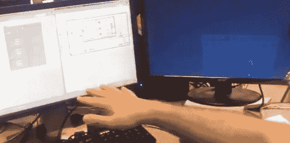

# 用跳跃运动控制四轴飞行器

> 原文：<https://hackaday.com/2012/11/18/controlling-a-quadcopter-with-a-leap-motion/>

国家仪器公司的几个人以 LabVIEW Hacker 的名义得到了一个 Leap Motion 开发套件。Leap 是一款有趣的小型输入设备，旨在跟踪 3D 空间中的指尖，很像 Kinect，但分辨率更高。需要一些东西来展示他们的 LabVIEW 能力，这些家伙[用 Leap](http://www.youtube.com/watch?v=ZoiwL0SK3jA) 控制他们的办公室 AR 无人机，制作了一个完全无触摸的四轴飞行器控制器。

基于他们之前的 AR 无人机攻击，LabVIEW 团队花了一天的大部分时间为 Leap SDK 添加包装器，并为他们的 RC 四轴飞行器添加控制。现在，只需在 Leap 传感器上移动他们的指尖，他们就可以使用非常高分辨率的 3D 扫描仪控制他们的办公室四旋翼飞行器。

休息后的视频。

[https://www.youtube.com/embed/ZoiwL0SK3jA?version=3&rel=1&showsearch=0&showinfo=1&iv_load_policy=1&fs=1&hl=en-US&autohide=2&wmode=transparent](https://www.youtube.com/embed/ZoiwL0SK3jA?version=3&rel=1&showsearch=0&showinfo=1&iv_load_policy=1&fs=1&hl=en-US&autohide=2&wmode=transparent)