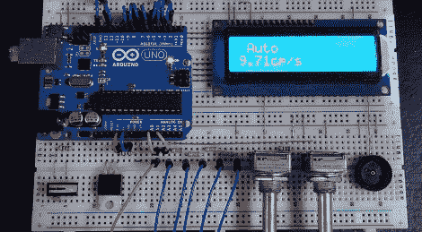

# 用 Arduino 控制土豆枪

> 原文：<https://hackaday.com/2012/08/19/controlling-a-spud-gun-with-an-arduino/>

我们离我们年轻时的水网动力塑料管开钻枪还有很长的路要走。[smirpab]在 SpudFiles 论坛上[发布了一个他正在制作的令人惊叹的 AS50 狙击步枪的复制品](http://www.spudfiles.com/forums/as-wip-50-t23957.html)。这种气动加农炮超越了我们见过的任何气动步枪，Arduino 能够通过液晶显示器和射速控制在自动、半自动和爆发模式之间切换。

[斯米尔帕]的构造对于这种级别的气枪来说是相当正常的；它使用压缩到大约 10 巴(145 磅/平方英寸)的空气，从光滑的枪管中射出 6mm 的塑料颗粒。电子设备是这个项目真正闪耀的地方，Arduino 控制着射击模式(自动，半自动和 3 发连发)，每秒的发数可以用锅来调节。

一个非常酷的项目，看看[smirpab]完成的项目的 CAD 渲染，我们迫不及待地想看到这个构建完成。像往常一样，这个版本带有标准的黑客警告“你会把你的眼睛挖出来，孩子”。休息之后，你可以看看[smirpab]的活塞视频，以及 Arduino 供电的控制电路经历所有三种点火模式的演示。

[https://www.youtube.com/embed/9JiIHEzi18c?version=3&rel=1&showsearch=0&showinfo=1&iv_load_policy=1&fs=1&hl=en-US&autohide=2&wmode=transparent](https://www.youtube.com/embed/9JiIHEzi18c?version=3&rel=1&showsearch=0&showinfo=1&iv_load_policy=1&fs=1&hl=en-US&autohide=2&wmode=transparent)