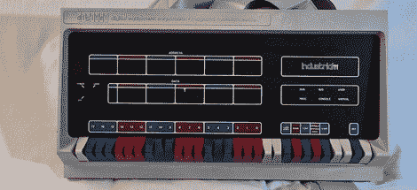

# 用现代计算机控制闪光灯

> 原文：<https://hackaday.com/2012/04/19/controlling-blinkenlights-with-modern-computers/>

一些老前辈可能记得，很久以前，电脑不需要键盘。最早的个人电脑如 Altair 8800 和服务器机架大小的微型电脑如 PDP-11 可以用一个装满开关和灯的面板来控制，这给了我们术语 *blinkenlights* 。今天，这些机器大部分已经被扔掉或锁在博物馆和私人收藏中；即使你得到了这些控制面板中的一个，你也要花很多时间用它做一些有用的事情。

不要害怕，因为[jrg]已经想出了一个很好的方法来控制这些闪光灯并模拟过去的计算机。他称他的建筑为 BlinkenBone，它能够从几十台历史计算机上控制 blinkenlight 面板，并模拟每个开关和小灯泡。

BlinkenBone 是一台 [BeagleBone](http://beagleboard.org/bone) 单板 Linux 计算机，运行着用于古董计算机的 [SimH](http://simh.trailing-edge.com/) 模拟器。现在，BlinkenBone 能够模拟 PDP-1、PDP-8、PDP-11、许多旧的 IBM 机器、Altair 8800，甚至一些惠普机器。

如果没有 BlinkenBone 或类似的模拟设备，这些计算机仍然存在的控制面板只是挂在墙上的艺术品。当他们运行一个模拟他们的原始硬件的时候，它们就变成了曾经有用的设备。此外，也更容易理解在过去的 40 年里科技取得了多大的进步。

休息之后，你可以在 PDP-11/40 上观看[jrg]使用他的 BlinkenBone 的简短演示。看那些灯光。

[https://www.youtube.com/embed/fEenHwSFmgQ?version=3&rel=1&showsearch=0&showinfo=1&iv_load_policy=1&fs=1&hl=en-US&autohide=2&wmode=transparent](https://www.youtube.com/embed/fEenHwSFmgQ?version=3&rel=1&showsearch=0&showinfo=1&iv_load_policy=1&fs=1&hl=en-US&autohide=2&wmode=transparent)