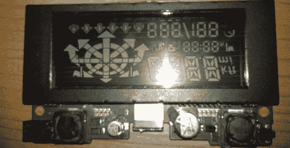

# 使用蓝牙控制 Garmin HUD

> 原文：<https://hackaday.com/2014/03/30/controlling-the-garmin-hud-with-bluetooth/>

Garmin HUD 是一个非常简洁的设备，它把你所有的导航信息，从 ETA，你应该在哪个车道，到你下一次右转的距离，都显示在你的挡风玻璃上。Garmin HUD 的唯一问题是，尽管它是一个蓝牙设备，但它只能与 Garmin 官方应用程序一起工作。现在，终于有人[钻研 Garmin HUD 协议](https://github.com/gabonator/Work-in-progress/tree/master/GarminHud)，允许任何人从手机、平板电脑或电脑控制这个 HUD。

由于完全无法拆卸 HUD 的 Navigon 应用程序，[gabonator]决定唯一能做的就是打开设备，偷看一下微控制器和蓝牙模块之间传输的一些数据包。

[gabonator]期望人类可读的 ASCII 字符，但在查看了从他的示波器解码的无意义内容并手动解码后，他试图简单地查看运行中的显示器，以了解协议是如何工作的。他[把它全部解码](https://github.com/gabonator/Work-in-progress/blob/master/GarminHud/PacketDesc.txt)，并设法让一个 Sygic 导航程序与这个 Garmin HUD 一起工作。你可以看看下面的视频。

谢谢[凯文]的提示。

[https://www.youtube.com/embed/E2sShBbIc48?version=3&rel=1&showsearch=0&showinfo=1&iv_load_policy=1&fs=1&hl=en-US&autohide=2&wmode=transparent](https://www.youtube.com/embed/E2sShBbIc48?version=3&rel=1&showsearch=0&showinfo=1&iv_load_policy=1&fs=1&hl=en-US&autohide=2&wmode=transparent)