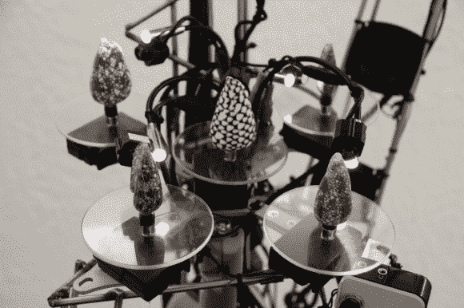

# conus 融合了媒体、数学和软体动物

> 原文：<https://hackaday.com/2013/09/05/conus-mixes-media-math-and-mollusks/>

我们喜欢以可能从未考虑过的方式使用技术的艺术装置，莫斯科媒体艺术家[Dimitry Morozov]已经用' [conus '做到了这一点，它读取软体动物外壳的表面](http://vtol.cc/filter/works/conus)，并将数据转化为实时音频和视频。这些贝壳是独特的；他们的色素生成自然的[细胞自动机](https://en.wikipedia.org/wiki/Cellular_automaton)。(如果你从未听说过细胞自动机，[康威的生命游戏](https://en.wikipedia.org/wiki/Conway's_Game_of_Life)是一个很好的例子，其中一个规则集决定了一个细胞是生存、死亡还是再生。

[迪米特里的]装置使用自制的数字显微镜扫描几个贝壳的自然生成的细胞自动机，每个贝壳在自己的圆盘上旋转。随着外壳的旋转，来自显微镜的扫描被输入一个算法，该算法将信号转换成多个音频通道和三个视频监视器的数据。休息之后，你可以在视频中观看生物形成模式的数学转换。

查看生命之盾的 MSP430 游戏中细胞自动机的另一个例子。

[https://player.vimeo.com/video/70039021](https://player.vimeo.com/video/70039021)