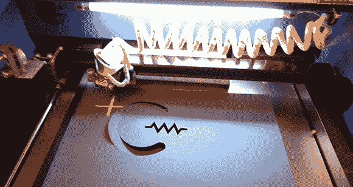

# 将中国激光切割机转换为使用 Mach3

> 原文：<https://hackaday.com/2012/12/13/converting-a-chinese-laser-cutter-to-work-with-mach3/>

像我们大多数人一样，[Chris]已经渴望在易贝买到非常非常便宜的中国激光切割机有一段时间了。当我们大多数人因为这些机器无法处理激光切割机常用的文件格式而忽视它们时，[Chris]决定冒险一试。他可能会感到失望，因为附带的软件不允许他使用装有 Mach3 CNC 软件的机器，所以[他用自己设计的一个](http://chriscircuits.blogspot.com/2012/11/converting-chinese-laser-cutter-to-work.html)替换了附带的电子板，以很低很低的中国易贝拍卖价给他一个更昂贵的激光切割机的所有功能。

[克里斯]买的激光切割机带有 moshidraw 软件和控制器板，根据一次拍卖，只能使用 BMP、JPEG、WMF、EMF 和 PLT 文件。想要一个可以使用更常见的文件格式如 PDF 和 DWG 的开发板，[Chris] [建造了他自己的开发板](http://chriscircuits.blogspot.com/2012/11/its-this-easy.html)来与他的 Mach3 软件通信。

据我们所知，这种新型主板可以与现成的 Pololu 步进驱动器配合使用，完全可以替代 moshidraw 主板。他仍在完成设计，但当布局、BOM 和原理图完成后，[Chris]会将文件上传给所有人复制。干得好，[克里斯]。

[https://www.youtube.com/embed/AHvsTBXyxXg?version=3&rel=1&showsearch=0&showinfo=1&iv_load_policy=1&fs=1&hl=en-US&autohide=2&wmode=transparent](https://www.youtube.com/embed/AHvsTBXyxXg?version=3&rel=1&showsearch=0&showinfo=1&iv_load_policy=1&fs=1&hl=en-US&autohide=2&wmode=transparent) [https://www.youtube.com/embed/xsgVQlvGLME?version=3&rel=1&showsearch=0&showinfo=1&iv_load_policy=1&fs=1&hl=en-US&autohide=2&wmode=transparent](https://www.youtube.com/embed/xsgVQlvGLME?version=3&rel=1&showsearch=0&showinfo=1&iv_load_policy=1&fs=1&hl=en-US&autohide=2&wmode=transparent)